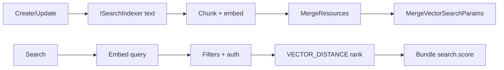

# ADR-2610: Semantic Vector Search Parameters

**Status**: Proposed
**Date**: 2026-10-05
**Feature**: semantic-search

## Context

Clinical free text (notes, narratives, `valueString`) is poorly served by token and string search. microsoft/fhir-server proposes direct-text semantic search ([#5802](https://github.com/microsoft/fhir-server/pull/5802), [#5803](https://github.com/microsoft/fhir-server/pull/5803), ADR-2608): a custom `special` SearchParameter selects text, the server embeds it, and queries rank resources by cosine similarity. We want SearchParameter definitions and client queries to move between the two servers unchanged, but Ignixa's write path, provider model and job infrastructure differ, so the internals cannot be ported directly.

## Options Considered

1. **Literal port** - embed synchronously and persist vectors inside `MergeResources` *(rejected: violates the rule that `MergeResources` and its TVPs are not modified, and makes one provider the weakest link of every write)*
2. **External vector store** - duplicates identity, tenancy and authorization boundaries *(rejected)*
3. **Wire-compatible contract, Ignixa-native internals** - same extension and query semantics; vectors in a tenant-database side table written after merge; provider-neutral embedding abstraction *(chosen)*

## Decision

**Contract (wire-compatible with fhir-server):**
- Semantic parameters are `special` SearchParameters whose FHIRPath yields text, configured by extension `http://microsoft.com/fhir/StructureDefinition/vector-search-config` (`extractionPolicy`, `maxInputTokens`, `minimumScore`, `chunkSizeTokens`, `chunkOverlapTokens`, `distanceMetric` = `cosine`). Invalid configuration makes the parameter unsupported.
- `GET /Observation?semantic-text=...&status=final` embeds the query once, applies ordinary filters and authorization first, ranks by best-chunk cosine distance, deduplicates per resource and returns `Bundle.entry.search.score = 1 - distance / 2`. Relevance is the default order; explicit `_sort` overrides it. One semantic parameter per query; semantic chains are rejected.

**Internals:**
- Embeddings use `Microsoft.Extensions.AI` `IEmbeddingGenerator<string, Embedding<float>>`; Azure OpenAI/Foundry is the shipped provider. Dimensions are fixed at 1536; other dimensions fail startup.
- Text comes from the existing `ISearchIndexer` extraction, is chunked by model tokenizer (`Microsoft.ML.Tokenizers`), and is embedded in the Application layer, not the DataLayer.
- `VectorSearchConfig` is parsed into `SearchParameterInfo`; `VectorSearchExpression` uses a default-throwing visitor method so unaware visitors fail loudly.
- SQL schema version 4 adds `EmbeddingModel` and `VectorSearchParam` keyed `(ResourceTypeId, ResourceSurrogateId, SearchParamId, EmbeddingModelId, ChunkOrdinal)` with compressed passage, SHA-256 and native `vector(1536)`. Rows are written by a separate procedure after `MergeResources`; delete, hard-delete and history cleanup remove them. Queries use exact `VECTOR_DISTANCE` with keyset continuation on `(distance, ResourceTypeId, ResourceSurrogateId)`.
- `Indexing.Mode` is `Synchronous` or `Asynchronous`. Synchronous embeds before merge, so provider failure fails the write with nothing committed. Asynchronous records pending vector work after merge and a background job embeds it; the same job backfills when a semantic parameter is activated, because Ignixa has no general reindex executor.
- The FileSystem provider persists sidecar vector files on write and ranks by brute-force cosine.

**Delivery scope:** the first deliverable is the contract, synchronous indexing and SQL query support end to end. Import skips embedding, and FileSystem rejects semantic parameters as unsupported, until the FileSystem and asynchronous/backfill work lands.

## Consequences

**Positive:**
- SearchParameters and client queries are portable between Ignixa and fhir-server.
- Provider-neutral: local development can use any 1536-dimension generator; tests use a deterministic one.
- Structured filtering, tenancy and authorization keep a single owner; ranking only orders their result.

**Negative:**
- Schema version 4 requires a native-vector engine (Azure SQL Database or SQL Server 2025+) even when the feature is disabled. Tenants on older engines stay at version 3; deployment probes `sys.types` and fails before DDL.
- Vector persistence is not atomic with the resource write. A post-merge failure is logged and leaves the resource absent from semantic results until backfill repairs it.
- Synchronous mode makes the embedding provider part of write and query availability.
- Exact search scans the filtered candidate set; approximate (DiskANN) search, linked-resource or Binary text, evidence/snippets and multi-model migration are out of scope.
