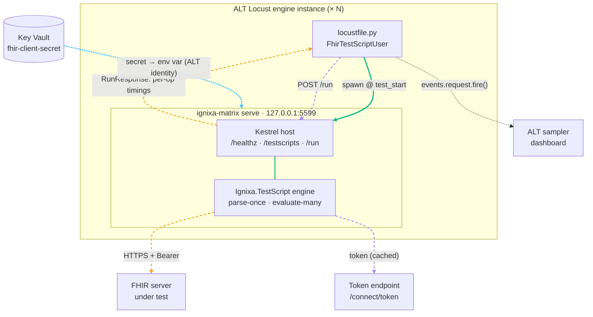
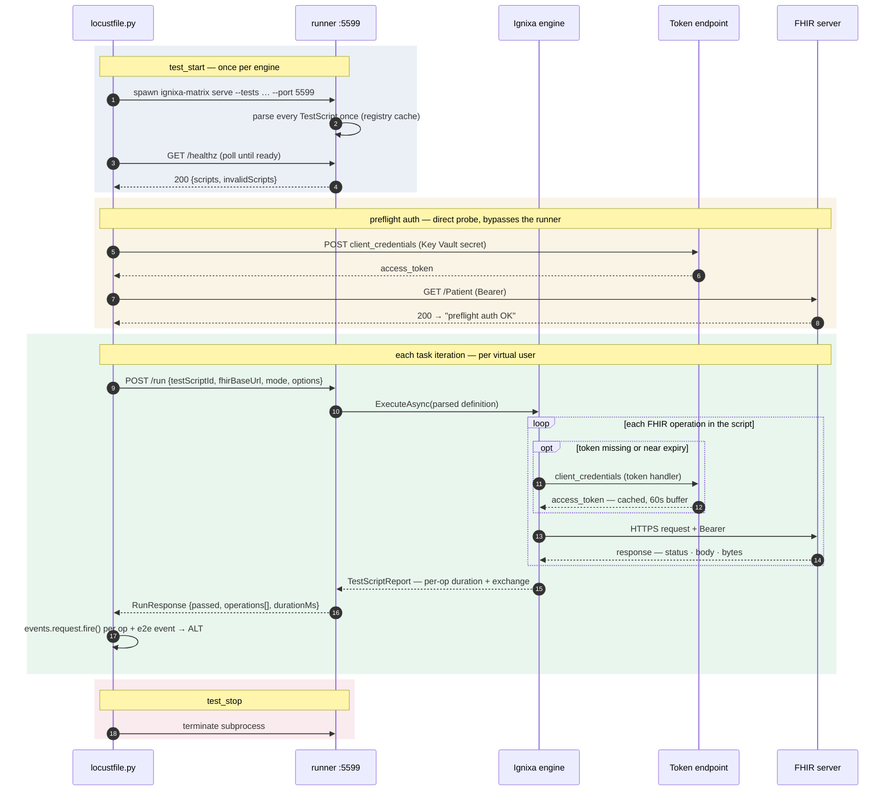

# How Locust communicates with the Ignixa engine

On each Azure Load Testing (ALT) engine instance, the locustfile spawns `ignixa-matrix serve` as
a **co-located sidecar** and drives it over localhost. The runner — not Locust — carries the FHIR
traffic, holds the tokens, and returns per-operation timings that the locustfile surfaces as ALT
sampler entries.

Two hops with very different cost: Locust → runner is a `127.0.0.1` POST (effectively free); the
measured latency is the runner → FHIR HTTPS hop, timed at the runner's own HttpClient.

## Topology — one sidecar per engine

Channels: **green** = localhost (Locust ⇄ runner); **blue** = FHIR HTTPS traffic; **amber** =
auth/secret; **violet** = metrics.

## Protocol — start to finish

## Why it's shaped this way

- **Parse once, run many.** Every TestScript is parsed at `serve` startup into a registry cache;
  `/run` evaluates an already-parsed `TestScriptDefinition`, so parsing never taxes the hot path.
- **Locust never holds a FHIR token.** The runner's `ClientCredentialsTokenHandler` acquires and
  caches the token (60s expiry buffer, single-flight refresh). Locust only touches auth in the
  `test_start` preflight probe, which fails the run fast if the target's auth is misconfigured.
- **Per-operation metrics.** The engine records each operation's duration and HTTP exchange in the
  `TestScriptReport`; `RunResponseMapper` turns that into `operations[]`, and the locustfile fires
  one `events.request.fire()` per operation plus an e2e event — so ALT charts FHIR-operation
  latency directly rather than one opaque "script passed" blob.

Source: `tools/Ignixa.ConformanceMatrix.Cli/loadtest/locustfile.py`,
`tools/Ignixa.ConformanceMatrix.Cli/Serving/RunnerHost.cs`,
`Serving/ClientCredentialsTokenHandler.cs`. See the [runbook](azure-e2e-runbook.md) for the live
end-to-end setup.
