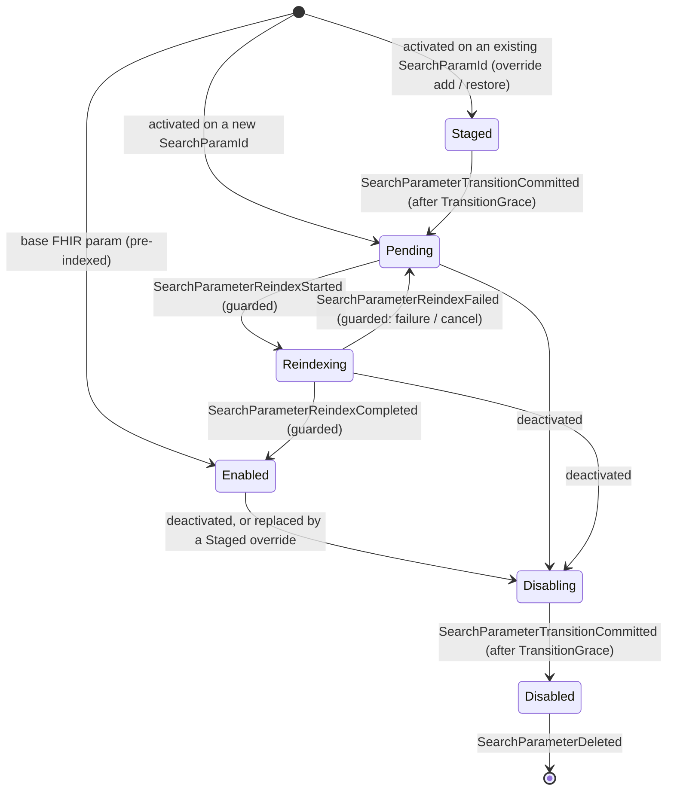
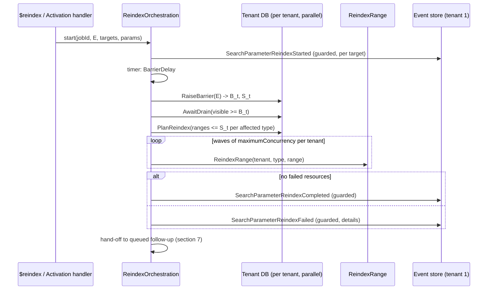

# Spec: `$reindex` for Ignixa

**Feature**: reindex
**Status**: Draft for review
**Created**: 2026-10-06
**Revised**: 2026-10-06. The reindex scope is now an exact per-tenant transaction cutoff, made safe by a
database-enforced conformance barrier. The per-row hash, per-transaction stamps, tail passes, and convergence
polling are gone (§5.6). Multi-instance search safety comes from two-phase transitions plus a fail-closed
staleness lease (§4.4, §4.5, §9.4).
**Prior art**: [microsoft-fhir-server-prior-art](investigations/microsoft-fhir-server-prior-art.md)

---

## 1. Goals and Non-Goals

### Goals

1. **Correct results.** A SearchParameter is searchable by default only after every current, non-deleted
   resource it applies to has been indexed under its definition, in every tenant.
2. **Exact scope from what already exists.** Activation events say *which* parameters and resource types changed.
   The transaction log says *which* rows were written before the change. There is no per-row bookkeeping.
3. **Self-driving.** Activations trigger reindexing automatically. Operators can also start, observe, and cancel
   it.
4. **Low impact on normal traffic.** Index-only writes create no new versions. Concurrent writers are not locked
   out. Throughput is bounded and tunable.
5. **Wire-compatible with microsoft/fhir-server** where that is honest: same routes, `Parameters` shapes, and
   tuning parameter names. Ignixa does not accept parameters it would ignore.

### Non-goals (v1)

- Extracting and writing only the changed parameters. v1 re-extracts every index row for each resource in
  scope, which is what `UpdateResourceSearchParams` already does.
- Resuming a cancelled job without redoing work. There is no per-row marker, so the replacement job rescans
  the scope.
- Pause and resume, reindexing history versions, and throttling based on data-store utilization.
- Cosmos and other non-SQL providers. They report reindex as unsupported (§6.6).

---

## 2. Current State (2026-10-06)

| Asset | State | Spec disposition |
|---|---|---|
| Transaction ids | `TransactionId = ms × 80000 + sequence`, the first value of the transaction's `ResourceSurrogateId` range (`MergeResourcesBeginTransaction.sql`). Visibility advances only across contiguous completed transactions (`MergeResourcesAdvanceTransactionVisibility.sql`). | **Basis of the cutoff** (§5) |
| Allocation choke point | Every SQL write (single, atomic bundle, batch/import) allocates through `SqlServerMergeRepository.BeginTransactionAsync` (`SqlServerFhirRepository.cs:293,508`) | **Barrier check goes here** (§5.3) |
| Write-path ordering | Search indexes are extracted *before* allocation (`SqlServerFhirRepository.cs:521-628`) | This is why a barrier is needed (§5.3) |
| `dbo.Parameters` | Key/value table already read by `MergeResourcesBeginTransaction` | **Holds the barrier value** |
| `SourceEvents.TransactionId` | Tenant 1's visible watermark at append time | Not used. Each tenant reads its own cutoff (§5.2). |
| `Resource.SearchParamHash`, compiler hash filter | Never written or used | **Not used.** Retire in cleanup (§8.7). |
| `UpdateResourceSearchParams.sql` | Exists (MS port), no caller | **Reuse** as the index-only write. Pass `NULL` hash. |
| `SqlServerPostMergeExtensionUpdater` | Runs after `MergeResources` | **Also run after reindex writes** |
| `ReindexJob` table plus 5 sprocs | Dead MS port | **Retire** (§8.7) |
| `SearchParameterStatus { Pending, Reindexing, Enabled, Disabled }` and reindex events | Exist (`ConformanceState.cs:365-389`); apply unconditionally | **Reuse, with guards** (§4.3). Add `Staged` and `Disabling` (§4.4). |
| Search visibility | `Pending` params are searchable; `Reindexing` params are dropped from extraction (`CompositeSearchParameterDefinitionManager.cs:161,253,280,374`) | **Fix** (§4.2) |
| Overrides | An override reuses the overridden param's `SearchParamId` (`ConformanceState.cs:42-56`) | Override changes use the two-phase transition (§4.4) |
| Conformance sync | Polls every 30s. A failed sync logs a warning and retries, and the instance **keeps serving with stale state** (`ConformanceStateSyncService.cs:44-57`) | **Staleness lease** for search (§4.5) |
| Background jobs | DurableTask; `$export` is the reference | **Follow it** (§8) |
| `ms-reindex.json` | MS-compatible TestScript, all asserts `warningOnly` | **Make it pass** (§11) |

---

## 3. Requirements

### Functional

| ID | Requirement |
|---|---|
| F1 | A SearchParameter in `Pending` or `Reindexing` is **not searchable** by default (§4.2). |
| F2 | A parameter moves to `Enabled` only after its job has reindexed the cutoff set (§5.2) for every resource type it applies to, in **every** tenant, with zero failed resources, **and** its activation is unchanged since the job started (§4.3). |
| F3 | Search indexes are extracted through an immutable **definitions handle** `(indexer, DefinitionsEventId)` that is acquired once per extraction (§5.4). |
| F4 | Every SQL transaction allocation checks the writer's `DefinitionsEventId` against the tenant's **conformance barrier**. A stale writer is rejected, refreshes its definitions, re-extracts, and retries (§5.3). |
| F5 | Activation automatically starts a job when `Reindex:AutoStart` is true. If a job is already running, a follow-up is **durably queued** (§7). |
| F6 | `POST [base]/$reindex` starts a job. `GET` returns its status or lists jobs. `DELETE` cancels it (§6). |
| F7 | `GET [base]/{type}/{id}/$reindex` is a dry run. `POST` persists the indexes for one resource. |
| F8 | At most **one** reindex job is active across the whole server. |
| F9 | Index-only writes never change `Version`, `LastUpdated`, `RawResource`, `meta`, the transaction, or history, and they never emit write side effects. |
| F10 | When a concurrent update makes a reindex write lose (`@FailedResources`), the resource is counted as a *conflict*, not a failure. |
| F11 | Per-resource extraction failures are recorded (type, id, surrogate id, reason) and shown in job status. While any remain, the affected parameters stay out of `Enabled`. |
| F12 | Request parameters that are not implemented are rejected with 400. |
| F13 | The CapabilityStatement advertises only `Enabled` parameters. |
| F14 | A change that alters how an *existing* `SearchParamId` is extracted (deactivation, adding an override, removing an override) runs in **two phases**. First the code is hidden from search while extraction stays unchanged. Extraction changes only after `TransitionGrace` (§4.4). |
| F15 | An instance answers requests that evaluate search parameters only while it holds a **conformance staleness lease**. That covers search, `_include`/`_revinclude`, compartment and `$everything` searches, and conditional create/update/patch/delete matching. Without the lease it returns `503` with `Retry-After` (§4.5). |

### Non-functional

| ID | Requirement |
|---|---|
| N1 | Throughput ≥ 5,000 resources/s per tenant database at default settings on the reference SQL tier, measured like `$export`. |
| N2 | Normal API p95 latency degrades ≤ 20% while a job runs at default settings. |
| N3 | Survives restarts, failover, and deployments. DurableTask replays completed ranges, and a range that is retried is idempotent. |
| N4 | Every terminal or degraded state is visible through status, logs, and metrics. That includes Failed, Cancelled, conflicts, failed resources, barrier rejections, and partial-index searches. |
| N5 | A fresh database finishes in under `BarrierDelay` + 5 s after activation (F5 developer experience). An **upgrade alone triggers no reindex**. |
| N6 | The barrier check adds no database round trip: it runs in the existing allocation command batch. Rejections are rare: they happen only to writers that are still behind after `BarrierDelay`. |
| N7 | Search availability is tied to conformance freshness. If an instance cannot sync with tenant 1 for longer than `MaxStaleness`, its searches fail closed (503). Reads by id, history reads, and unconditional writes keep working. |

---

## 4. SearchParameter Lifecycle and Query Semantics

### 4.1 States

| Status | Extracted on write? | Searchable (default)? | With partial-index header? | In CapabilityStatement? |
|---|---|---|---|---|
| `Enabled` | Yes | Yes | Yes | Yes |
| `Staged` | No (the outgoing definition still owns the id) | No | No | No |
| `Pending` | **Yes** | No | Yes, with a warning | No |
| `Reindexing` | **Yes** (fixes the current gap) | No | Yes, with a warning | No |
| `Disabling` | **Yes** (unchanged until commit) | No | No | No |
| `Disabled` | No | No | No | No |

### 4.2 Query-time behavior

- Wire up `SearchableSearchParameterDefinitionManager` as the searchable resolver. Map `Pending` and
  `Reindexing` to `IsSearchable = false` and `IsSupported = true`. Map `Staged` and `Disabling` to
  `IsSearchable = false` and `IsSupported = false`, so the partial-index header cannot admit them.
- **Default:** a non-searchable parameter is treated like an unknown parameter. Under
  `Prefer: handling=lenient` it is ignored, and the bundle includes an `OperationOutcome` warning
  (*"Search parameter '{code}' is pending reindex and was ignored."*). Under `handling=strict` the request
  returns 400.
- **Opt-in:** with request header `x-ms-use-partial-indices: true`, `Pending` and `Reindexing` params are
  admitted, and the bundle **must** carry an `OperationOutcome` warning that results may be incomplete. MS
  stays silent here; Ignixa warns.
- When an override is `Staged`, `Pending`, or `Reindexing`, the overridden code is not searchable either, because
  both definitions share one `SearchParamId`.
- `_sort` follows the same rules.

### 4.3 Lifecycle guards

The `SearchParameterReindex{Started,Completed,Failed}` events gain `ActivationEventId`, the `SourceEvents.EventId`
of the activation the job targeted. The field is nullable so older events still replay. `ConformanceState`
applies each event **only if** both conditions hold:

- the parameter's current activation has that `ActivationEventId`, and
- for `Completed` and `Failed`, its `ReindexJobId` equals the event's `JobId`.

A non-matching event is ignored and logged. A job therefore never moves a newer activation of the same canonical:
it does not start it, enable it, or reset it. The newer activation stays `Pending` and is handled by the queued
follow-up (§7). `SearchParameterTransitionCommitted` (§4.4) carries the activation and deactivation `EventId`s it
commits, and it is guarded the same way.

### 4.4 Two-phase transitions (deactivation and overrides)

**Problem.** Suppose instance A applies a change that alters how an existing `SearchParamId` is extracted, while
instance B has not applied it yet. B keeps *searching* with the old definition, and A *writes* rows extracted the
new way (or not extracted at all). B's results are then wrong. The barrier (§5.3) cannot help, because A's writes
are up to date; the stale party is B's *read*.

**Rule.** Every change to the extraction of an existing `SearchParamId` happens in two phases:

| Phase | Event | Search | Extraction |
|---|---|---|---|
| 1. Hide | `SearchParameterDeactivated` or `SearchParameterActivated` (override add/remove) | The code becomes non-searchable as each instance applies the event. The outgoing definition moves to `Disabling`, and an incoming one moves to `Staged`. | **Unchanged.** The outgoing definition still owns the id. |
| 2. Commit | `SearchParameterTransitionCommitted`, appended by `SearchParameterTransitionOrchestration` after a durable timer of `TransitionGrace` | No change | `Disabling` becomes `Disabled` (no longer extracted), and `Staged` becomes `Pending` (extracted). A `Pending` result triggers reindex (§7). |

**Why this is safe.** Let *t_h* be the commit time of the hide event. Phase 2 commits at *t_c ≥ t_h + TransitionGrace*,
and writes change extraction only on instances that have applied phase 2, so only after *t_c*. An instance may
search only while it holds the lease (§4.5), which requires a successful sync that *started* at
*s ≥ t − MaxStaleness*. If *s ≥ t_h*, that sync read the hide event, so the instance no longer searches with the
outgoing definition. That holds because `SqlServerSourceEventStore` serializes `EventId` allocation through commit,
so a reader never advances past an uncommitted lower id. An instance can therefore search with the outgoing
definition only at *t < t_h + MaxStaleness*. Requiring **`TransitionGrace > MaxStaleness`** (validated at startup)
puts every such search before *t_c*, while extraction is still unchanged.

**Cases.**

- **Plain deactivation** (no other definition shares the id): Hide, then Commit. No reindex. Orphaned rows are
  never queried, because ids are never reassigned across canonicals (`GetOrAllocateSearchParamId`). They are
  removed when the type is next reindexed or the resource is next written. Operators can reclaim storage early
  with a manual `targetResourceTypes` job.
- **Override added on an extracted id:** the base moves to `Disabling` and the override to `Staged`. After Commit,
  the override is `Pending` and gets reindexed.
- **Override removed:** the override moves to `Disabling` and the restored definition to `Staged`. After Commit,
  the restored definition is `Pending` and gets reindexed. Today the base would simply be `Enabled` again, over
  rows that still hold the override's values; this changes that.
- **New id** (a brand-new canonical): no phase 1. It goes straight to `Pending`, because nothing that was
  searchable has changed.

`SearchParameterTransitionOrchestration` is started by the activation handler. Startup reconciliation commits any
transition whose grace period has elapsed but which is still uncommitted (§7).

### 4.5 Conformance staleness lease

- Each instance records `LeaseStartUtc`: the **start** time, on a monotonic clock, of its most recent sync whose
  catch-up **and** consumer refresh both succeeded (`ConformanceStateSyncService`, `ConformanceCacheRefresher`).
  Initial state load counts as such a sync, and so does applying a local activation.
- An instance holds the lease while `now − LeaseStartUtc ≤ Conformance:MaxStaleness`. The default is
  `2 × SyncIntervalSeconds`.
- **Without the lease**, every request that evaluates search parameters (F15) **fails closed**. It returns `503`
  with `Retry-After` and an `OperationOutcome` (*"Conformance state is stale; search is temporarily
  unavailable."*). Reads by id, history reads, and unconditional writes continue. Write extraction staleness is
  already fenced by the barrier (§5.3) and by the two-phase rule.
- Losing and regaining the lease is logged at warning and information level. Metrics:
  `conformance.lease.lost` and `conformance.lease.age`.
- Startup validates `TransitionGrace > MaxStaleness`, and also `BarrierDelay ≥ MaxStaleness` so barrier rejections
  stay rare, and fails fast if either does not hold.

---

## 5. Reindex Scope: Barrier-Fenced Transaction Cutoff

### 5.1 Terms

| Term | Meaning |
|---|---|
| **E** | Target position: the global `SourceEvents.EventId` when the job starts. The job targets every param `Pending` at E. |
| **Affected types** | The base resource types of the targeted params, expanded to concrete types, plus the restored types for override removals. `targetResourceTypes` narrows the set. |
| **D(w)** | The `DefinitionsEventId` of the handle that extracted write *w*'s indexes (§5.4). |
| **Barrier_t** | `dbo.Parameters['Conformance.MinAcceptedDefinitionsEventId']` in tenant *t*'s database. It only increases. |
| **B_t** | `MAX(SurrogateIdRangeFirstValue)` in tenant *t*'s `dbo.Transactions`, read **after** raising Barrier_t to E. |
| **S_t** | `MAX(SurrogateIdRangeLastValue)` in tenant *t*'s `dbo.Transactions`, read with B_t. Using the maximum *last* value avoids depending on ranges being ordered or disjoint (§5.5). |

### 5.2 Algorithm (per tenant, in parallel)

1. **Delay.** Wait `Reindex:BarrierDelay` (default `2 × Conformance:SyncIntervalSeconds`) after E is appended.
   This lets instances catch up by polling, so the barrier rejects almost nothing. It is advisory only; the
   barrier alone guarantees correctness.
2. **Raise the barrier.** Set `Barrier_t = max(Barrier_t, E)`, **then** read B_t and S_t.
3. **Drain.** Wait until tenant *t*'s visible watermark is ≥ B_t, so every transaction allocated at or before B_t
   has completed or failed. Both values come from the database; there is no wall-clock comparison.
4. **Cutoff set.** Reindex the current, non-deleted rows of affected types with `ResourceSurrogateId ≤ S_t`.
   This is a range scan on the clustered key, and its totals are exact once planning finishes. Rows written
   before this feature are included automatically.

That set is the whole job. There is no tail, and nothing to verify afterwards.

### 5.3 Barrier check on allocation

`SqlServerMergeRepository.BeginTransactionAsync(count, definitionsEventId, …)` runs one command batch:

1. `EXEC dbo.MergeResourcesBeginTransaction …` (unchanged).
2. `SELECT Bigint FROM dbo.Parameters WHERE Id = 'Conformance.MinAcceptedDefinitionsEventId'`.

If `definitionsEventId < barrier`, the repository marks the transaction failed (through the existing
commit-with-failure path, so visibility can advance) and throws `StaleConformanceDefinitionsException`. The write
pipeline catches it **at the boundary**, forces `ConformanceState.CatchUpAsync` and a refresh, re-acquires a
handle, re-extracts, and retries **once**. If it is still stale, the request returns `503` with `Retry-After`.
Every rejection is logged and counted (`conformance.barrier.rejections`).

**Ordering proof.** The writer reads the barrier *after* its own allocation has committed. The raiser reads B_t
*after* the barrier is set. So for any stale writer with allocation *X*, exactly one of these holds:

- *X* was visible to the raiser's read, so *X* ≤ B_t. Its rows are drained (step 3) and fall inside the cutoff
  set (step 4).
- *X* was not visible to that read. Then *X* committed after the barrier was set, so the writer's barrier read
  sees E and the write is rejected.

No locks are needed. This also holds under RCSI, because the writer's barrier read always happens after its own
commit.

### 5.4 Definitions handle

`CompositeSearchParameterDefinitionManager`/`ConformanceCacheRefresher` publish an immutable
`DefinitionsHandle(ISearchIndexer Indexer, long DefinitionsEventId)`. The event id is the position the indexer's
definitions were built from, which is the *refreshed* position, not `ConformanceState.LastProcessedEventId`.

- The write pipeline acquires one handle per extraction.
- Bundles use the **minimum** `DefinitionsEventId` across the handles that produced their final index sets. If an
  entry is re-resolved, its handle is replaced too.
- Long-running imports re-acquire a handle per batch. A rejected batch re-extracts with a fresh handle.

### 5.5 Edge cases

| Case | Why it is covered |
|---|---|
| A transaction with first value ≤ B_t but last value > B_t (import reserves 1000 ids) | S_t is the maximum *last* value, so its rows are included. |
| Clock rollback, or sequence reuse, produces a *post*-barrier transaction with an id < B_t | It passed the barrier check, so D ≥ E. If it lands in the cutoff set, the cost is extra work; nothing is wrong. The drain waits for it like any other transaction. |
| Delete tombstones | They have `IsDeleted = 1` and no indexes, so they are excluded. |
| Invisible history and history moves | Only `IsHistory = 0` rows are reindexed. A version superseded during the job becomes a conflict (F10), and its replacement was either inside the cutoff (and processed) or passed the barrier. |
| Newly started instance | It initializes `ConformanceState` and builds handles before serving, so D is current. If not, the barrier rejects the write. |
| Instance paused (GC) and resumed after the barrier | Its stale handle is rejected at allocation. |
| Pre-feature rows with no `Transactions` entry | `ResourceSurrogateId ≤ S_t` still holds, because surrogate ids are time-based and S_t is the current maximum. Invariant test: every SQL resource write allocates through `BeginTransactionAsync`. |

### 5.6 Why not a hash, stamps, or convergence polling?

| Approach | Problem |
|---|---|
| Per-row hash (first draft) | Must be maintained on every row; an upgrade marks every pre-feature row stale; scope is "all rows, filtered". |
| Cutoff only at activation time | Instances that lag (they poll every 30 s) and the extract-before-allocate order let stale writes land after the cutoff. |
| Cutoff + per-transaction stamp + convergence polling (second draft) | Convergence is not a closed barrier: new instances, idle imports holding old handles, and paused processes can write after it. Tail cursors can skip incomplete transactions. A wall-clock τ is not in the database's id space. |
| **Barrier-fenced cutoff (this spec)** | The database fences off stale writers. Scope is one clustered range. There is no stamp column, tail, registry, or checkpoint table. The trade-off is that a write from an instance still behind after `BarrierDelay` is rejected once and retried. |

---

## 6. API

`[base]` is `/` in single-tenant mode, or `/tenant/{tenantId}` with `tenantId ≠ 0`. A job is **server-wide**
because SearchParameter status is global (§10.1). Routes are registered before the `/{resourceType}` catch-all,
as for `$export` (`EndpointRouteBuilderExtensions.cs:34`).

### 6.1 Kickoff: `POST [base]/$reindex`

- **Body:** optional `Parameters`.
- **Headers:** `Prefer: respond-async` is optional. Any other `Prefer` value returns 400.
- **Response:** `201 Created` with a `Parameters` job body (§6.3) and `Content-Location: [base]/$reindex/{jobId}`.
  This matches MS and `ms-reindex.json`.
- **Active job exists:** `409 Conflict` with an `OperationOutcome` and a `Content-Location` header pointing to the
  active job (Q3).
- **Nothing to do** (no `Pending` params and no `targetResourceTypes`): `400` with the existing "no resources
  need reindexing" message.

| Parameter | Type | Range | Default | Effect |
|---|---|---|---|---|
| `maximumNumberOfResourcesPerQuery` | integer | 1..10000 | 10000 | Target range size (§8.3) |
| `maximumNumberOfResourcesPerWrite` | integer | 1..10000 | 1000 | Worker page and TVP batch size (§8.4) |
| `maximumConcurrency` | integer | 1..16 | 4 | Concurrent range workers **per tenant** |
| `queryDelayIntervalInMilliseconds` | integer | 0..60000 | 0 | Delay between worker pages |
| `targetResourceTypes` | string (comma list) | Known, concrete types | Affected types (§5.1) | Narrows the scope. With nothing `Pending`, it runs a maintenance reindex that enables nothing. |
| `targetSearchParameterTypes`, `targetDataStoreUsagePercentage` | n/a | n/a | n/a | **400 Not supported** (F12) |
| Any other name, or a non-numeric value for an integer | n/a | n/a | n/a | **400** |

The published `OperationDefinition/reindex` lists exactly these accepted parameters.

### 6.2 Status and list

- `GET [base]/$reindex/{jobId}` returns `200` with a `Parameters` body, or `404`.
- `GET [base]/$reindex` returns `200` with a `Parameters` resource containing one `job` part per job: active,
  queued, and the most recent N terminal ones.

### 6.3 Job `Parameters` body

The MS-compatible top-level parameters are `id`, `status`, `queuedTime`, `startTime`, `endTime`, `lastModified`,
`totalResourcesToReindex`, `resourcesSuccessfullyReindexed`, `progress` (capped at 99.9 until `Completed`),
`resources`, `searchParams`, `maximumNumberOfResourcesPerQuery`, `maximumNumberOfResourcesPerWrite`, and
`failureDetails`.

Ignixa additions:

- `maximumConcurrency`, `queryDelayIntervalInMilliseconds`
- `trigger`: `Manual`, `Activation`, `FollowUp`, or `Reconciliation`
- `targetEventId` (E)
- `phase`: `BarrierDelay`, `Draining`, `Reindexing`, or `Completing`
- `cancellationReason`
- `conflicts`
- `tenant` (repeating), with parts `tenantId`, `cutoffTransactionId` (B_t), `cutoffSurrogateId` (S_t), `status`,
  `resourcesToReindex`, `resourcesReindexed`, `conflicts`, and `failedResources`
- `failedResource` (repeating, ≤ 100), with parts `resourceType`, `id`, and `reason`
- `ignoredLifecycleEvents`: canonicals whose activation changed after E (§4.3)

`status` is one of `Queued`, `Running`, `Completed`, `Failed`, or `Cancelled`.

### 6.4 Cancel: `DELETE [base]/$reindex/{jobId}`

Returns `202 Accepted`, `404` for an unknown job, or `409` if the job is already terminal. The orchestration is
terminated. A guarded `Failed("Cancelled")` event returns this job's `Reindexing` params to `Pending`. The barrier
stays raised (it only increases). A queued follow-up is not cancelled.

### 6.5 Single resource: `GET|POST [base]/{type}/{id}/$reindex`

- **GET** (dry run) returns `200` with a `Parameters` resource listing every index value that would be extracted
  (parts `code`, `type`, `value`). Nothing is persisted.
- **POST** persists the indexes through the §8.4 write path. If a concurrent update wins, it returns `409`.
- Unknown id returns `404`. A deleted resource returns `410`. Status changes are never made.

### 6.6 Provider capability

When the tenant's provider does not implement `IReindexStore`, the endpoints return `501` with an
`OperationOutcome`. Package params stay `Pending` and can be searched only with the partial-index header.

### 6.7 Authorization

Callers need the same administrative authorization as `/admin/packages`. The single-resource GET also needs read
access to the resource.

---

## 7. Triggering and Durable Hand-off

| Trigger | Behavior |
|---|---|
| **Activation** (`Reindex:AutoStart = true`, default) | After activation events that create `Pending` params commit (including override removals, §4.4), a Medino notification handler calls `StartOrQueueReindex(Activation)`, debounced by `Reindex:StartDebounce`. |
| **Manual** | `POST $reindex` (§6.1). |
| **Transition commit** | When `SearchParameterTransitionCommitted` produces `Pending` params (an override added or removed, §4.4), the orchestration calls `StartOrQueueReindex(Activation)`. |
| **Follow-up** | Hand-off at job end (below). |
| **Startup reconciliation** | `EternalOrchestrationStarter` (replacing the commented-out line 55). It commits any transition whose `TransitionGrace` has elapsed, then, if `Pending` params exist, no job is active, and nothing is queued, it starts a job. |

**Durable hand-off** (prevents the lost-follow-up race between job end and a concurrent activation):

- `StartOrQueueReindex` takes the singleton lock (`sp_getapplock` on the tenant 1 database). If a job is active,
  it **persists** an incremented `ReindexRequestedGeneration` instead of returning silently.
- At job end, `CompleteReindexActivity`, under the same lock, marks the job terminal. If the generation is
  greater than the one the job consumed, or if `Pending` params still exist, it starts the follow-up job before
  releasing the lock.

`LoadPackageHandler` and `InstallPackageTool` keep reporting `PendingReindex`, and now also return the job id
(active or queued) and its status URL.

---

## 8. Job Design

### 8.1 Components

All components live in `src/Application/Ignixa.Application.BackgroundOperations/Reindex/` and mirror `$export`.

| Component | Role |
|---|---|
| `CreateReindexJobCommand` / `Handler` | Validates input. Runs `StartOrQueueReindex` (§7). Writes `BackgroundJob<ReindexJobDefinition>` (`BackgroundJobType.Reindex = 4`) to the tenant 1 job store. Starts the orchestration with `instanceId = jobId`. |
| `ReindexOrchestration` | The coordinator (§8.2). |
| `RaiseBarrierActivity` | For each tenant: raises Barrier_t to E, then returns B_t and S_t (§5.2 step 2). |
| `AwaitDrainActivity` | For each tenant: waits for the visible watermark to reach B_t (step 3). |
| `PlanReindexActivity` | For each tenant and affected type: surrogate ranges up to S_t (§8.3). |
| `ReindexRangeActivity` | Processes one (tenant, type, range) (§8.4). |
| `CompleteReindexActivity` | Appends guarded lifecycle events, finalizes the job, and performs the hand-off (§7). |
| `SearchParameterTransitionOrchestration` | Runs a durable `TransitionGrace` timer, then appends a guarded `SearchParameterTransitionCommitted` (§4.4), then calls `StartOrQueueReindex` if anything became `Pending`. Lives in `…/Conformance/` next to the activation pipeline. |
| `GetReindexStatusQuery`, `CancelReindexCommand`, `ReindexSingleResourceCommand` | API handlers. |

### 8.2 Orchestration flow

- `BarrierDelay` is a DurableTask timer, so it costs nothing and survives restarts.
- Tenants run in parallel, each limited by `maximumConcurrency`, as in `TtlCleanupOrchestration`.
- Ranges are scheduled in waves. Above `Reindex:ContinueAsNewThreshold` scheduled activities, the orchestration
  calls `ContinueAsNew` and carries B_t, S_t, and the counts forward.

### 8.3 Range planning

The planner generalizes `ISearchService.GetExportRangesAsync` to
`IReindexStore.GetSurrogateIdRangesAsync(type, upperBound: S_t, targetRangeSize)`, sizing ranges at about
`maximumNumberOfResourcesPerQuery` current rows.

### 8.4 Range worker

1. **Definitions guard.** Acquire a handle. If its `DefinitionsEventId` is < E, throw a retryable error;
   DurableTask retries after backoff.
2. **Read.** Read current, non-deleted rows in the range through `IReindexStore.ReadRangeAsync`, in pages of
   `maximumNumberOfResourcesPerWrite`, ordered by `ResourceSurrogateId`.
3. **Extract** with the handle. An exception is recorded as a failed resource (F11), and the resource is skipped.
4. **Write** with `UpdateResourceSearchParams`. It matches on `IsHistory = 0`, allocates no transaction, and
   changes no version, so the barrier does not apply. Then run `SqlServerPostMergeExtensionUpdater` for inserted
   token rows. Add `@FailedResources` to `conflicts` (F10).
5. If `queryDelayIntervalInMilliseconds > 0`, wait that long. Repeat until the range is done.
6. Return counts and failures (≤ 100).

Retries use the established SQL transient policy. When a write times out, the worker halves its batch size and
retries, down to a minimum of 10.

### 8.5 Completion

A targeted parameter **completes** when its affected types are reindexed in every tenant with zero failed
resources. `CompleteReindexActivity` then appends
`SearchParameterReindexCompleted(…, ActivationEventId, JobId, ResourcesIndexed, Duration)`, which §4.3 applies or
ignores. Otherwise the job ends `Failed` with a guarded `SearchParameterReindexFailed`. Either way, the hand-off
in §7 runs.

Lifecycle start and its initial progress write share the singleton reindex job lock with terminal completion.
After acquiring the lock, the updater reloads the job and skips lifecycle start, progress writes, and
heartbeat changes if it is `Completing`, `Completed`, `Failed`, or `Cancelled`. Only terminal completion may
resume a persisted `Completing` decision. A delayed activity cannot reopen a finalized job or its parameters.

### 8.6 Failure and liveness

- **Activity failure after retries:** that (tenant, type) is marked failed, the other tenants continue, and the
  job ends `Failed`. Unlike MS, one bad range does not abort healthy tenants.
- **Liveness:** every activity updates the `BackgroundJob` heartbeat. A job that is `Running` with a heartbeat
  older than `Reindex:StaleJobTimeout` is flagged in status and logged at error level. A drain still waiting
  beyond `Reindex:DrainWarningAfter` logs the oldest incomplete transaction. `TransactionWatcher` already
  recovers stalled transactions, so the drain does not wait forever.

### 8.7 Data layer changes

| Change | Notes |
|---|---|
| `IReindexStore` (Domain) with a SQL implementation | `RaiseBarrierAsync(E) → (B, S)`, `GetVisibleWatermarkAsync`, `GetSurrogateIdRangesAsync`, `ReadRangeAsync`, `UpdateSearchIndicesAsync → (updated, conflicts)` |
| `dbo.Parameters` row `Conformance.MinAcceptedDefinitionsEventId` | Stored in the existing `Bigint` column, so no schema change is needed (`Tables/Parameters.sql`). Raised monotonically with an `UPDATE … SET Bigint = @E WHERE Id = … AND (Bigint IS NULL OR Bigint < @E)`, plus an insert if the row is missing. |
| `BeginTransactionAsync(count, definitionsEventId)` | One command batch: the existing `EXEC` plus the barrier `SELECT` (§5.3). `IFhirRepository.GetNextTransactionIdAsync` and the batch-write APIs take the handle's event id. |
| `StaleConformanceDefinitionsException` | Handled at the write boundary (refresh, re-extract, one retry, then 503) |
| Reindex lifecycle events gain `ActivationEventId` (nullable) | §4.3, and registration in `SqlServerSourceEventStore` |
| `SearchParameterStatus` gains `Staged` and `Disabling`; new event `SearchParameterTransitionCommitted` | §4.4. Apply logic in `ConformanceState`. `CompositeSearchParameterDefinitionManager` extracts `Enabled`, `Pending`, `Reindexing`, and `Disabling`, and **not** `Staged`. |
| Staleness lease (`LeaseStartUtc`) in `ConformanceStateSyncService`, and a search-entry guard | §4.5. The guard sits where search options are built (`SearchOptionsBuilderFactory`), so search, includes, compartments, and conditional matching all pass through it. |
| `ReindexRequestedGeneration` (tenant 1, with the job store) | §7 hand-off |
| `UpdateResourceSearchParams.sql` | Reused unchanged. Must be verified against Ignixa's typed tables, including composites. |
| Extension columns | Reuse `SqlServerPostMergeExtensionUpdater`, following the merge-transaction rule |
| Retire `ReindexJob` table plus 5 sprocs; `Resource.SearchParamHash` usage, `MatchPageEmitter` hash clause, `SearchPlanOptions.SearchParameterHash` | Unused. Separate cleanup PR. The `ResourceList` TVP column stays (repository rule), so pass `NULL`. |
| `MergeResources*` procedures and TVPs | **Unchanged** |

---

## 9. Consistency and Concurrency

### 9.1 Correctness argument

Fix a tenant *t* and a current row *r* of an affected type at completion time. Its transaction was allocated
either:

- **(a) at or before B_t.** Then *r*'s surrogate id is ≤ S_t, and *r* was reindexed under definitions ≥ E. If a
  newer version replaced *r* during the job, the reindex write was a conflict, and the replacement falls under
  (a) or (b).
- **(b) after B_t was read.** Then the writer read the barrier after its allocation committed, saw ≥ E, and passed
  only with D(w) ≥ E. Its indexes already include the target definitions.

Rows that are both outside (a) and stale cannot exist. The guards in §4.3 make sure "the target definitions" are
the ones that get enabled: a definition changed after E is not enabled by this job.

### 9.2 Concurrent resource writes

Normal writes are never blocked by the job. They can be rejected only by the barrier, and only when they carry a
stale handle. When a reindex write targets a version that has just become history, the `IsHistory = 0` join drops
it as a conflict.

### 9.3 Concurrent SearchParameter changes (queue, don't supersede)

A new activation during a running job neither cancels it nor is rejected. Its params stay `Pending` and are
covered by the durably queued follow-up (§7). The running job keeps going: its workers' handles are ≥ E, and §4.3
keeps it from touching the newer activation. Superseding would throw away completed ranges, because there is no
per-row marker. Rejecting with 409, as MS does, would block package installs.

### 9.4 Multi-instance behavior

Instance **A** applies a conformance change at event E. Instance **B** has not applied it yet: it polls every
`SyncIntervalSeconds`, and its sync may also be failing.

| Situation | Instance A (at ≥ E) | Instance B (behind E) | Outcome |
|---|---|---|---|
| **New parameter (new id): search** | `Pending`, so it is ignored with a warning (strict: 400) | Unknown, so it is ignored as unknown (strict: 400) | The same visible behavior on both. No partial results. |
| **New parameter: writes before the barrier** | Extracts the new parameter | Does not extract it. The barrier is still < E, so the write is accepted. | B's row is allocated at or before B_t, so it is inside the cutoff set and gets reindexed (§5.2). |
| **New parameter: writes after the barrier** | Accepted | Rejected at allocation. B forces a catch-up, re-extracts, and retries once; if it is still stale, it returns 503 (§5.3). | No row extracted without the parameter can land after the cutoff. |
| **New parameter: after completion** | Searchable | Still `Reindexing` for at most one poll, so it is ignored with a warning | Becomes searchable on different instances at slightly different times. Results are never wrong. The CapabilityStatement can differ between instances for the same window. |
| **Deactivation or override change: phase 1** | The code is hidden; extraction is unchanged | Still searches with the outgoing definition; extraction is unchanged | B's results stay complete, because every row is still extracted the old way (§4.4). |
| **Deactivation or override change: phase 2** (≥ `TransitionGrace` later) | Extraction changes | By now B has either applied the hide event (lease, §4.5) or lost its lease | No instance searches with the outgoing definition over rows extracted the new way. |
| **B's sync failing for longer than `MaxStaleness`** | n/a | Lease lost: search and conditional writes return 503; reads by id, history, and plain writes continue | Fails closed and is observable (`conformance.lease.lost`). |
| **Partial-index header** | Admits `Pending`/`Reindexing` with a warning | Ignores parameters it does not know about | Inconsistent only in how much it *returns*. Every response that may be incomplete carries a warning. |

---

## 10. Multi-Tenancy, Configuration, Observability

### 10.1 Multi-tenancy

- E is global, from tenant 1's `SourceEvents`. Barrier_t, B_t, S_t, and the drain are **per tenant database**.
  Transaction ids and visibility are local to each database, so tenant 1's `SourceEvents.TransactionId` is never
  used for other tenants.
- A job fans out over all configured tenants, excluding tenant 0. A parameter completes only when every tenant
  completes.
- Job metadata, the singleton lock, and `ReindexRequestedGeneration` live with the global conformance state in
  tenant 1. Status resolves from any tenant route.

### 10.2 Configuration

**`Conformance` section (new keys):**

| Key | Default | Purpose |
|---|---|---|
| `MaxStaleness` | `2 × SyncIntervalSeconds` | Lease length for serving search (§4.5) |
| `TransitionGrace` | `MaxStaleness + SyncIntervalSeconds` | Phase-2 delay; must be `> MaxStaleness`, checked at startup (§4.4) |

**`Reindex` section:**

| Key | Default | Purpose |
|---|---|---|
| `Enabled` | `true` | Registers the endpoints and the orchestration |
| `AutoStart` | `true` | Activation-triggered jobs (§7) |
| `BarrierDelay` | `2 × Conformance:SyncIntervalSeconds` | Advisory catch-up time before the barrier (§5.2); must be `≥ MaxStaleness` |
| `DefaultMaximumNumberOfResourcesPerQuery` | `10000` | §6.1 |
| `DefaultMaximumNumberOfResourcesPerWrite` | `1000` | §6.1 |
| `DefaultMaximumConcurrency` | `4` | §6.1 |
| `StartDebounce` | `00:00:10` | §7 |
| `OrphanGrace` | `00:02:00` | Minimum job age before two missing/terminal orchestration-state reads can classify it as orphaned (§8.6) |
| `StaleJobTimeout` | `00:30:00` | §8.6 |
| `DrainWarningAfter` | `00:05:00` | §8.6 |
| `ContinueAsNewThreshold` | `2000` | §8.2 |
| `RecentTerminalJobsListed` | `10` | §6.2 |

### 10.3 Observability

- **Structured logs** with a `Reindex:` prefix, including `jobId`, `tenantId`, `resourceType`, `range`, `E`,
  `B_t`, `S_t`, `phase`, and counts.
- **Metrics:** `reindex.resources.processed`, `.conflicts`, and `.failed`; `reindex.ranges.active`;
  `reindex.drain.wait`; `reindex.job.duration`; `conformance.barrier.rejections` (tagged by retry outcome);
  `conformance.lease.lost`; `conformance.lease.age`; `conformance.transition.pending`;
  `search.partial_index.requests`.

---

## 11. Test Plan and Delivery

### 11.1 Tests

All tests follow the `GivenContext_WhenAction_ThenResult` naming convention.

| Layer | Scenarios |
|---|---|
| Unit (`Ignixa.Application.Tests`) | Pending and Reindexing are hidden by default; the partial-index header admits them with a warning; strict vs lenient handling; CapabilityStatement shows `Enabled` only; the §4.3 guards (a `Started`/`Completed`/`Failed`/`TransitionCommitted` event for an older activation or another job is ignored); the two-phase states (`Staged` is not extracted, `Disabling` is extracted, neither is searchable; Commit moves them to `Pending`/`Disabled`); override add and remove go through `Staged`; the lease (search, includes, and conditional matching return 503 once `MaxStaleness` passes without a successful sync; reads by id and plain writes still succeed; the lease is measured from sync *start*); startup validation rejects `TransitionGrace ≤ MaxStaleness`; F12 validation; singleton, 409, durable generation hand-off, and debounce; the handle's `DefinitionsEventId` is atomic with its indexer; bundles use the minimum. |
| Orchestration (DurableTask test host) | delay → barrier → drain → plan → ranges → complete; definitions guard retries; `ContinueAsNew` carries B_t and S_t; one tenant's failure is isolated; cancel compensation; follow-up starts when an activation races job end; the transition orchestration commits after `TransitionGrace` and triggers reindex for `Pending`; startup reconciliation commits a transition that is overdue. |
| SQL integration (`TestTenantDatabase`) | Barrier raised monotonically; B_t and S_t are read after it. **Barrier race:** a stale writer that allocates concurrently with the raise is either ≤ B_t or rejected, in a loop of interleavings including under RCSI. The rejected transaction is marked failed and visibility advances. The cutoff set is exactly current, non-deleted rows with surrogate id ≤ S_t, including an import reservation that straddles B_t. `UpdateResourceSearchParams` rewrites every typed table and changes no version, transaction, or history (F9). `IsHistory` conflicts (F10). Extension columns are populated. Every write path allocates through `BeginTransactionAsync` (invariant). |
| E2E (`Ignixa.Api.E2ETests`, SQL) | Install a package: the search warns and ignores the new param, the job completes, and the search returns the pre-existing resources. A write extracted with a stale handle after the barrier is rejected, refreshed, retried, and indexed correctly. Multi-tenant: completion waits for both tenants. A second package installed mid-job gets a follow-up job. Override add then remove (two-phase, with a reindex after each Commit). **Two instances** (two `IgnixaApiFixture` hosts on one database with a long sync interval on B): deactivating on A keeps B's search results complete until Commit; B's searches return 503 once its sync is forced to fail beyond `MaxStaleness`. Single-resource GET dry run and POST persist. |
| TestScript | `ms-reindex.json` passes, and its asserts become required. |
| Scale | 10M Patient: N1/N2 at defaults; the barrier `SELECT` adds no measurable write latency (N6). |

"Pending is searchable" is a **regression** test (it fails at base). The barrier-race and lifecycle-guard tests are
**guards**, and each needs a mutation check: remove the barrier read, and remove the guard, and confirm the test
fails.

### 11.2 Delivery phases

| Phase | Scope | Independently valuable because |
|---|---|---|
| **0: Correctness and plumbing** | §4.2 visibility and partial-index header; `Reindexing` added to the extraction set; CapabilityStatement filter; two-phase transitions (`Staged`/`Disabling`, the transition orchestration); staleness lease; `DefinitionsHandle`; the barrier check in `BeginTransactionAsync` (barrier stays at 0 until the first job); lifecycle guards | It stops today's silent wrong results, on a single instance and in a web farm. Once a job raises the barrier, the write path is already correct. |
| **1: Job** | `IReindexStore`, the orchestration (delay, barrier, drain, ranges), `POST`/`GET`/`DELETE $reindex`, retiring `ReindexJob` | Parameters actually reach `Enabled`. |
| **2: Automation** | Activation trigger and debounce, durable follow-up hand-off, startup reconciliation | Hands-off package installs. |
| **3: Tools and polish** | Single-resource `$reindex`, `targetResourceTypes` and maintenance jobs, query delay, dashboards, user docs (`docs/site/docs/server/fhir/search-parameters.md`, `configuration.md`), the hash cleanup PR | Operability. |

---

## 12. Open Questions

| # | Question | Recommendation |
|---|---|---|
| Q1 | Is a writer that is still behind after `BarrierDelay` getting a one-time reject-and-retry (or a 503) acceptable? | Yes. It only happens when an instance missed more than 2 sync intervals, which is already a fault. Add an advisory instance-lag checkpoint only if the rejection metrics show impact. |
| Q2 | Is adding the barrier `SELECT` to the begin-transaction command batch within the spirit of "do not modify `MergeResources` procedures"? | Yes. No procedure or TVP changes. A dedicated procedure called in the same batch is an alternative if reviewers prefer. |
| Q3 | Duplicate kickoff: 409 (explicit), or return the existing job with 201 (MS-compatible)? | 409 with `Content-Location`. Revisit if MS clients break. |
| Q4 | Should failed resources (F11) block `Enabled` indefinitely? | Block by default. Possibly add an operator override `acceptFailedResources=true` that records the excluded ids. |
| Q5 | Tenant-scoped jobs? | Not in v1, because status is global. |
| Q6 | Job metadata store: tenant 1 `BackgroundJob`, or a dedicated system store? | Tenant 1, with the global conformance state. |
| Q7 | Should plain deactivation schedule an optional cleanup job for orphan rows? | No for v1. Orphans are harmless and are cleaned opportunistically. |
| Q8 | Should the lease fail **all** search when stale, or only searches that touch parameters whose definitions could have changed? | All of them. Base parameters can be overridden, so an instance that is stale cannot know which codes are safe. Fail-closed was chosen by the user (2026-10-06). |
| Q9 | Should single-instance deployments skip the lease and the phase-2 delay? | Keep both, with the same code path. The defaults cost about 90 s of delay before a deactivation takes extraction effect, and nothing else. `Conformance:MaxStaleness` can be raised for single-instance deployments. |
