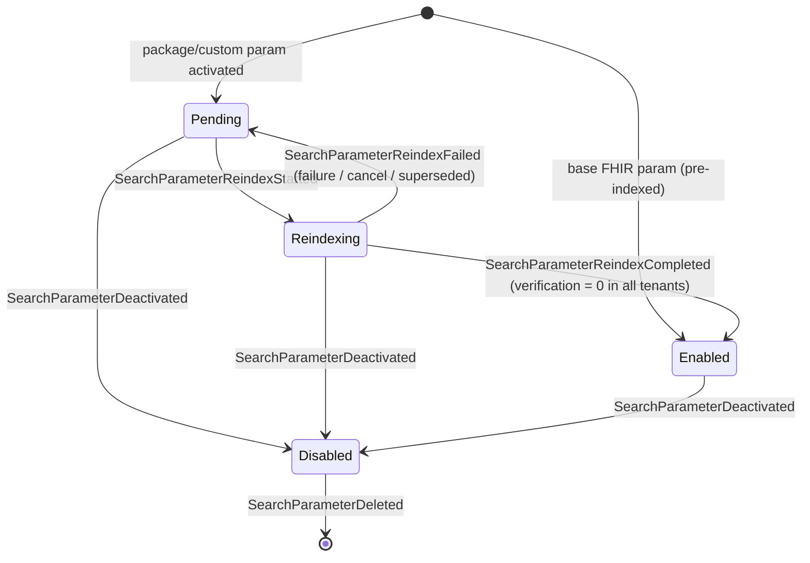
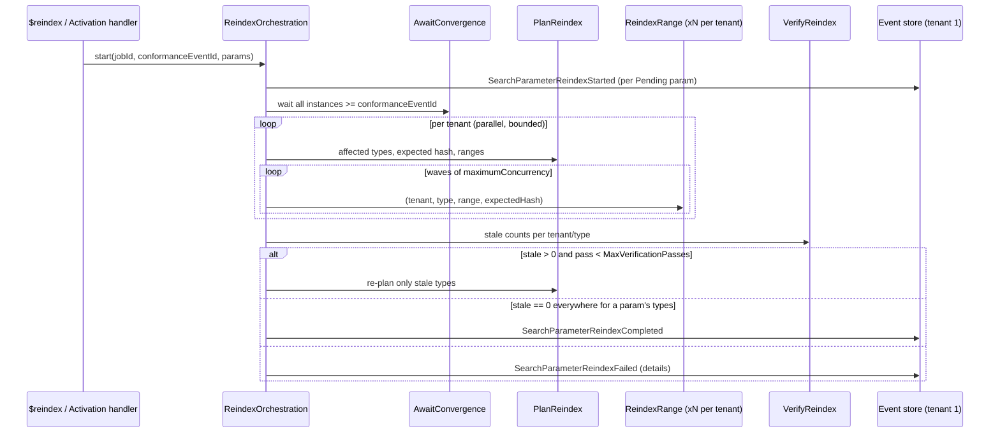

# Spec: `$reindex` for Ignixa

**Feature**: reindex
**Status**: Draft for review
**Created**: 2026-10-06
**Prior art**: [microsoft-fhir-server-prior-art](investigations/microsoft-fhir-server-prior-art.md)

---

## 1. Goals and Non-Goals

### Goals

1. **Correct results.** A SearchParameter is searchable by default only after every current, non-deleted
   resource it applies to has been indexed under its definition, in every tenant.
2. **Self-driving.** Activating or deactivating a SearchParameter (via a package or a custom definition)
   triggers the reindex work automatically. Operators can also start, observe, and cancel it.
3. **Low impact on normal traffic.** Index-only writes create no new versions. Concurrent writers win without
   being locked out, and throughput is bounded and tunable.
4. **Resumable and idempotent.** Runs survive restarts, can be cancelled, and pick up only the work that is
   still stale.
5. **Wire-compatible with microsoft/fhir-server** where that compatibility is honest: the same routes,
   `Parameters` shapes, and tuning parameter names. Ignixa does not accept parameters it would ignore.

### Non-goals (v1)

- Extracting and writing only the changed parameters. v1 re-extracts every index row for each stale resource,
  which is what `UpdateResourceSearchParams` already does. Partial extraction can come later as an
  optimization.
- Pause and resume. DurableTask supports `Suspend`/`Resume`, but v1 ships only cancel.
- Reindexing history versions. Only current rows (`IsHistory = 0`) carry search indexes.
- Throttling based on data-store utilization (`targetDataStoreUsagePercentage`).
- Cosmos and other non-SQL providers. They must report reindex as unsupported (§6.6).

---

## 2. Current State (2026-10-06)

| Asset | State | Spec disposition |
|---|---|---|
| `Resource.SearchParamHash` column | Exists, never written (`ResourceRowGenerator.cs:119`, `TODO Phase 2`) | **Write it on every create/update** (§5) |
| `GetSearchParameterHashForResourceType` | Covers base params only. Composite manager delegates to the base manager (`CompositeSearchParameterDefinitionManager.cs:415-417`) | **Include package params** (§5) |
| Compiler hash filter `SearchParamHash IS NULL OR <> @hash` | Exists (`MatchPageEmitter.cs:125-138`, `SearchPlanOptions.SearchParameterHash`) | **Reuse** for worker paging and verification |
| `UpdateResourceSearchParams.sql` | Exists (MS port), no caller | **Reuse** as the index-only write |
| `SqlServerPostMergeExtensionUpdater` | Runs after `MergeResources` | **Also run after reindex writes** |
| `ReindexJob` table plus 5 sprocs | Dead MS port, no caller | **Retire** (§8.7) |
| `SearchParameterStatus { Pending, Reindexing, Enabled, Disabled }` and reindex events | Exist (`ConformanceState.cs:365-389`) | **Reuse** (§4) |
| Search visibility | `Pending` params are searchable; `Reindexing` params are dropped from the extraction set (`CompositeSearchParameterDefinitionManager.cs:161,253,280,374`) | **Fix** (§4.2) |
| `SearchableSearchParameterDefinitionManager` | Implemented, never wired (`SearchServicesRegistration.cs:211` returns the full manager) | **Wire up** (§4.2) |
| Background jobs | DurableTask. `$export` is the reference pattern | **Follow it** (§8) |
| `ms-reindex.json` | MS-compatible TestScript; all asserts are `warningOnly` | **Make it pass** (§11) |

---

## 3. Requirements

### Functional

| ID | Requirement |
|---|---|
| F1 | A SearchParameter with status `Pending` or `Reindexing` is **not searchable** by default (§4.2). |
| F2 | A parameter moves to `Enabled` only after verification (§8.5) finds **zero** stale resources for every resource type it applies to, in **every** tenant. |
| F3 | Every create, update, and conditional write stamps `Resource.SearchParamHash` with the hash for that resource type at the writing instance's conformance position. |
| F4 | Activating or deactivating a SearchParameter starts a reindex job automatically when `Reindex:AutoStart` is true. A job that is already running is superseded (§9.3). |
| F5 | `POST [base]/$reindex` starts a job. `GET` returns its status or lists jobs. `DELETE` cancels it (§6). |
| F6 | `GET [base]/{type}/{id}/$reindex` returns the index values that would be extracted (dry run). `POST` persists them for that one resource. |
| F7 | At most **one** reindex job is active across the whole server at any time. |
| F8 | Index-only writes never change `Version`, `LastUpdated`, `RawResource`, `meta`, or history, and never emit write-side effects (subscriptions, audit of resource change). |
| F9 | When a concurrent update makes a reindex write lose (`@FailedResources`), the resource is counted as a *conflict*, not a failure. Verification re-examines it. |
| F10 | Per-resource extraction failures are recorded (type, id, surrogate id, reason) and shown in job status. While any remain, the affected parameters stay out of `Enabled`. |
| F11 | Request parameters that are not implemented are rejected with 400. None are silently ignored. |
| F12 | The CapabilityStatement advertises only `Enabled` parameters. |

### Non-functional

| ID | Requirement |
|---|---|
| N1 | Throughput target: ≥ 5,000 resources/s per tenant database at default settings on the reference SQL tier. Measure it the same way as `$export`. |
| N2 | Normal API p95 latency degrades ≤ 20% while a job runs at default settings. |
| N3 | Survives process restarts, failover, and deployments. Resumes without redoing up-to-date rows (the hash filter guarantees this). |
| N4 | Every terminal or degraded state (Failed, Cancelled, Superseded, conflicts, failed resources, partial-index searches) is visible through status, logs, and metrics. |
| N5 | A fresh database finishes with zero work in under 5 s after activation. This keeps F5 fast. |

---

## 4. SearchParameter Lifecycle and Query Semantics

### 4.1 States (existing enum, refined semantics)

| Status | Extracted on write? | In hash? | Searchable (default)? | Searchable with partial-index header? | In CapabilityStatement? |
|---|---|---|---|---|---|
| `Enabled` | Yes | Yes | Yes | Yes | Yes |
| `Pending` | **Yes** | **Yes** | No | Yes, with a warning | No |
| `Reindexing` | **Yes** (fixes the current gap) | **Yes** | No | Yes, with a warning | No |
| `Disabled` | No | No | No | No | No |

**Invariant H-STATUS:** the hash must **not** depend on status. Moving `Reindexing` to `Enabled` must not
make every resource stale. `CalculateSearchParameterHash` already ignores status, and this invariant pins that.

Disabling a parameter takes effect immediately, because removing a parameter from search is always safe. It
also changes the hash for its types, so the next reindex deletes its leftover rows. There are no
`PendingDisable` or `PendingDelete` states (see prior art §Tradeoffs).

### 4.2 Query-time behavior

- Wire up `SearchableSearchParameterDefinitionManager` as the searchable resolver. Set `IsSearchable = false`
  and `IsSupported = true` for `Pending` and `Reindexing` params when converting `ActiveSearchParameter`.
- **Default:** a non-searchable parameter is treated like an unknown parameter. Under `Prefer: handling=lenient`
  it is ignored, and the bundle includes an `OperationOutcome` warning:
  *"Search parameter '{code}' is pending reindex and was ignored."* Under `handling=strict` the request fails
  with 400.
- **Opt-in:** with request header `x-ms-use-partial-indices: true` (MS-compatible name), `Pending` and
  `Reindexing` params are admitted. The bundle **must** include an `OperationOutcome` warning:
  *"Results for '{code}' may be incomplete: reindex in progress."* This differs from MS, which stays silent.
- `_sort` on a parameter whose sort index is not yet complete follows the same rules.

---

## 5. Search Parameter Hash

| ID | Rule |
|---|---|
| H1 | `hash(version, tenant, resourceType) = CalculateSearchParameterHash(effective extraction set)`. The set contains base params plus package params in `Enabled`, `Pending`, or `Reindexing`, after overrides are applied. |
| H2 | `CompositeSearchParameterDefinitionManager` computes and caches H1 itself, and invalidates the cache on `ConformanceCacheRefresher.RefreshAsync`. |
| H3 | `ResourceRowGenerator` writes H1 into `SearchParamHash` (closes `TODO Phase 2`). The value is taken from the **same** manager instance that produced the extracted index rows, so a row's hash always describes its own index rows. |
| H4 | Ordinal-stable across hosts. This already holds and is guarded by `SearchParameterHashCultureInvarianceTests`. |
| H5 | Status-independent (H-STATUS, §4.1). |

**Stale resource:** a current, non-deleted row (`IsHistory = 0 AND IsDeleted = 0`) whose
`SearchParamHash IS NULL OR SearchParamHash <> @hash`. Rows written before this feature have `NULL` and are
therefore stale. The first job after upgrade reindexes everything once, by design.

---

## 6. API

`[base]` is `/` in single-tenant mode, or `/tenant/{tenantId}` (where `tenantId ≠ 0`). The job is **server-wide**
because SearchParameter status is global (§10.1). The tenant segment in the route is used for routing and
authorization only. Routes are registered before the `/{resourceType}` catch-all, the same way as `$export`
(`EndpointRouteBuilderExtensions.cs:34`).

### 6.1 Kickoff: `POST [base]/$reindex`

- **Body:** an optional `Parameters` resource.
- **Headers:** `Prefer: respond-async` is optional. Any other `Prefer` value returns 400.
- **Response:** `201 Created` with a `Parameters` job body (§6.3) and `Content-Location: [base]/$reindex/{jobId}`.
  This matches MS and `ms-reindex.json`.
- **Active job exists:** `409 Conflict` with an `OperationOutcome` that references the active job, plus a
  `Content-Location` header that points to it. MS returns the existing job with 201; Ignixa returns an explicit
  conflict (open question Q3).

| Parameter | Type | Range | Default | Effect |
|---|---|---|---|---|
| `maximumNumberOfResourcesPerQuery` | integer | 1..10000 | 10000 | Target range size used by range planning (§8.3) |
| `maximumNumberOfResourcesPerWrite` | integer | 1..10000 | 1000 | Worker page and TVP batch size (§8.4) |
| `maximumConcurrency` | integer | 1..16 | 4 | Concurrent range workers **per tenant** |
| `queryDelayIntervalInMilliseconds` | integer | 0..60000 | 0 | Delay between worker pages |
| `targetResourceTypes` | string (comma list) | Known, concrete types | All affected (§8.2) | Narrows scope. Params enable only if fully covered (F2). |
| `targetSearchParameterTypes` | n/a | n/a | n/a | **400 Not supported** (F11) |
| `targetDataStoreUsagePercentage` | n/a | n/a | n/a | **400 Not supported** (F11) |
| Any other name, or a non-numeric value for an integer | n/a | n/a | n/a | **400** |

Defaults come from configuration (§10.2). The published `OperationDefinition/reindex` lists exactly these
accepted parameters.

### 6.2 Status and list

- `GET [base]/$reindex/{jobId}` returns `200` with a `Parameters` job body, or `404` if the job does not exist.
- `GET [base]/$reindex` returns `200` with a `Parameters` resource containing one `job` part per job. It lists
  active jobs plus the most recent N terminal ones (default N = 10).

### 6.3 Job `Parameters` body

The MS-compatible top-level parameters are `id`, `status`, `queuedTime`, `startTime`, `endTime`, `lastModified`,
`totalResourcesToReindex`, `resourcesSuccessfullyReindexed`, `progress` (0–100, capped at 99.9 until
`Completed`), `resources` (comma list of types), `searchParams` (comma list of canonicals),
`maximumNumberOfResourcesPerQuery`, `maximumNumberOfResourcesPerWrite`, and `failureDetails`.

Ignixa additions:

- `maximumConcurrency`
- `queryDelayIntervalInMilliseconds`
- `trigger`: `Manual` or `Activation`
- `conformanceEventId`: the target event position
- `cancellationReason`: `UserRequested` or `Superseded`, plus `supersededBy` (jobId)
- `verificationPasses`
- `conflicts`: the count from F9
- `tenant` (repeating), with parts `tenantId`, `status`, `resourcesToReindex`, `resourcesReindexed`,
  `conflicts`, and `failedResources`
- `failedResource` (repeating, capped at 100), with parts `resourceType`, `id`, and `reason`

`status` is one of `Queued`, `Running`, `Completed`, `Failed`, or `Cancelled`. These are the MS values. A
superseded job is reported as `Cancelled` with `cancellationReason = Superseded`.

### 6.4 Cancel: `DELETE [base]/$reindex/{jobId}`

Returns `202 Accepted`. Returns `404` if the job does not exist, and `409` if it is already terminal (uses the
existing resx message). Cancelling terminates the orchestration. Its `Reindexing` params go back to `Pending`
(§8.6). Rows already written stay in place because they are correct for their hash.

### 6.5 Single resource: `GET|POST [base]/{type}/{id}/$reindex`

- **GET** (dry run) returns `200` with a `Parameters` resource listing every index value that would be extracted.
  Each value is a part with `code`, `type`, and `value`. Nothing is persisted.
- **POST** extracts and persists the indexes for the current version through the same write path as §8.4, then
  returns the same body. If a concurrent update wins, it returns `409`.
- Both return `404` (unknown id) or `410` (deleted).
- This operation does not change parameter status. It is a diagnostic and repair tool.

### 6.6 Provider capability

`$reindex` endpoints return `501 Not Implemented` with an `OperationOutcome` when the tenant's data provider
does not implement `IReindexStore` (§8.7). On such providers, package params stay `Pending`, and they can be
searched only with the partial-index header.

### 6.7 Authorization

Callers need the same administrative authorization as `/admin/packages`. The single-resource GET also needs
read access to the resource.

---

## 7. Triggering

| Trigger | Behavior |
|---|---|
| **Activation** (`Reindex:AutoStart = true`, default) | After `PackageActivationPipeline` or custom-SearchParameter activation commits events that change any H1 hash, a Medino notification handler calls `StartOrSupersedeReindex(trigger: Activation)`. |
| **Deactivation** | The same handler, because deactivation changes H1 so that orphan rows get removed. |
| **Manual** | `POST $reindex` (§6.1). |
| **Startup reconciliation** | `EternalOrchestrationStarter` (replacing the commented-out line 55) checks once at startup. If any `Pending` params exist (or a hash changed) and no job is active, it starts a job. This recovers from a trigger that was lost in a crash. |

`LoadPackageHandler` and `InstallPackageTool` keep reporting `PendingReindex`, and now also return the
`jobId` and status URL.

---

## 8. Job Design

### 8.1 Components

All components live in `src/Application/Ignixa.Application.BackgroundOperations/Reindex/` and mirror the
`$export` layout.

| Component | Role |
|---|---|
| `CreateReindexJobCommand` / `Handler` | Validates input, acquires the reindex singleton lock (SQL `sp_getapplock` on the tenant 1 database, then checks for an active job; no lock abstraction exists in code yet), writes `BackgroundJob<ReindexJobDefinition>` (`BackgroundJobType.Reindex = 4`) to the global (tenant 1) job store, and starts the orchestration with `instanceId = jobId`. |
| `ReindexOrchestration` | The coordinator (§8.2–§8.6). |
| `AwaitConformanceConvergenceActivity` | Waits until every live instance has applied `conformanceEventId` (§9.2). |
| `PlanReindexActivity` | For each tenant and affected type: captures the expected hash and computes surrogate-id ranges. |
| `ReindexRangeActivity` | Processes one tenant/type/range (§8.4). Returns counts plus failures. |
| `VerifyReindexActivity` | Counts stale resources for each tenant and type. |
| `CompleteReindexActivity` | Appends the `SearchParameterReindex{Completed,Failed}` events and finalizes the `BackgroundJob`. |
| `GetReindexStatusQuery` / `CancelReindexCommand` / `ReindexSingleResourceCommand` | API handlers. |

### 8.2 Orchestration flow

- **Target position:** `conformanceEventId` is the value of `ConformanceState.LastProcessedEventId` when the
  job is created. The orchestration input records it, together with the set of targeted `Pending` canonicals.
- **Affected types for a tenant** are computed in this order:
  1. `targetResourceTypes`, if supplied.
  2. Otherwise, types whose current H1 differs from the hash map recorded by that tenant's last `Completed`
     job.
  3. Otherwise (first run, or no record), every concrete type that has rows in the tenant.
- Tenants run in parallel. Each tenant is limited by `maximumConcurrency`, so one large tenant cannot starve
  the others. This mirrors `TtlCleanupOrchestration`'s per-tenant fan-out.
- **Orchestration history size:** ranges are scheduled in waves. When the scheduled-activity count exceeds
  `Reindex:ContinueAsNewThreshold` (default 2000), the orchestration calls `ContinueAsNew` and carries its
  progress forward in the input.

### 8.3 Range planning

The planner reuses the `ISearchService.GetExportRangesAsync` surrogate-id partitioning, generalized to
`GetSurrogateIdRangesAsync(type, targetRangeSize)`, and sizes each range at about
`maximumNumberOfResourcesPerQuery` rows. Ranges cover **all** rows of the type. Workers skip rows that are
already current (§8.4), so planning does not have to scan the hash.

### 8.4 Range worker

For each range `(tenant, type, [start, end], expectedHash)`:

1. **Hash guard.** Compute the local H1 for `(tenant, type)`.
   - If it equals `expectedHash`, continue.
   - If the local state is **behind** `conformanceEventId`, throw a retryable error. DurableTask retries after
     backoff.
   - If the local state is **ahead** (a newer activation happened), return `Superseded`. The orchestration stops
     scheduling work (§9.3).
2. **Page.** Run a compiled search with `SurrogateRange = [cursor, end]` and `SearchParameterHash = expectedHash`
   for current, non-deleted rows ordered by `ResourceSurrogateId`, limited to `maximumNumberOfResourcesPerWrite`.
3. **Extract.** For each resource, use the same extractor and row generators as the normal write path, with H1
   stamped (H3). An extraction exception is recorded as a failed resource (F10), and the resource is skipped.
4. **Write.** Call `UpdateResourceSearchParams` (matches on `IsHistory = 0`, does not bump the version). Then
   call `SqlServerPostMergeExtensionUpdater` for the inserted token rows. Add `@FailedResources` to the
   `conflicts` count (F9).
5. Advance the cursor past the page. If `queryDelayIntervalInMilliseconds > 0`, wait that long. Repeat until
   the range is exhausted.
6. Return `{processed, reindexed, conflicts, failedResources[≤100], superseded}`.

Retries: SQL transient errors and timeouts use the established SQL retry policy. When a write times out, the
worker halves its batch size and retries, down to a minimum of 10. This adapts the MS OOM back-off.

### 8.5 Verification and completion

- `VerifyReindexActivity` counts stale rows for each `(tenant, type)` using the compiler's count path with
  `SearchParameterHash = expectedHash`.
- Stale rows come from conflicts, workers that lost a race, or late writes from lagging instances. If any are
  found and the pass count is below `Reindex:MaxVerificationPasses` (default 3), the orchestration re-plans only
  the stale types.
- A targeted parameter **completes** when every one of its resource types has a stale count of 0 in every
  tenant, and no failed resources remain for those types. `CompleteReindexActivity` then appends
  `SearchParameterReindexCompleted(…, ResourcesIndexed, Duration)` for it.
- Otherwise the job ends `Failed` and appends `SearchParameterReindexFailed(…, ErrorMessage)` with a summary.
  `failureDetails` and the `failedResource` parts list the specifics.
- The job also records the per-tenant H1 hash map it verified, which is used as input to §8.2 on the next run.

### 8.6 Cancellation and failure

- **Cancel (user or supersede):** `TaskHubClient.TerminateInstanceAsync`, then a compensating
  `CompleteReindexActivity` that runs from the handler. It appends `SearchParameterReindexFailed("Cancelled:
  {reason}")` for each param still in `Reindexing`, then marks the job `Cancelled`.
- **Activity failure after retries:** the orchestration catches it. That tenant/type is marked failed, the
  other tenants continue, and the job ends `Failed` (§8.5). One bad range does not abort healthy tenants, which
  is a deliberate difference from MS.
- **Liveness:** the `BackgroundJob` heartbeat is updated by every activity. A job that is `Running` with a
  heartbeat older than `Reindex:StaleJobTimeout` (default 30 min) is reported as such in status and logged at
  error level. Startup reconciliation (§7) can then supersede it. This addresses the MS "stuck in Queued" class
  of bugs.

### 8.7 Data layer changes

| Change | Notes |
|---|---|
| `IReindexStore` (Domain) with a SQL implementation | `GetSurrogateIdRangesAsync`, `UpdateSearchIndicesAsync(batch) → (updated, conflicts)`, `CountStaleAsync(type, hash)`. File system and other providers do not implement it (§6.6). |
| `ResourceRowGenerator` writes `SearchParamHash` | H3 |
| `UpdateResourceSearchParams.sql` | Reused as is. **Must** be verified against Ignixa's typed tables, including composites. |
| Extension columns after reindex writes | Reuse `SqlServerPostMergeExtensionUpdater`. Follows the merge-transaction rule: core rows commit first, extension updates follow, and failures are logged. |
| Retire `ReindexJob` table and its 5 sprocs | Dead code that is superseded by DurableTask plus `BackgroundJob`. Removed through the normal schema-version process. |
| `ConformanceInstanceCheckpoint` table (tenant 1) | Needed for §9.2 (open question Q1). Columns: `InstanceId`, `LastProcessedEventId`, `HeartbeatUtc`. |
| `MergeResources` | **Unchanged** (repository rule). |

---

## 9. Consistency and Concurrency

### 9.1 Concurrent resource writes

A normal write during a job re-extracts the resource with the writer's definitions and stamps H1 (H3). If the
writer had already converged, the row is current and the worker's hash filter skips it. If the worker's
`UpdateResourceSearchParams` targeted the version that just became history, the `IsHistory = 0` join drops it
as a conflict. The new version was written by the normal path, so nothing is lost. Verification confirms it.

### 9.2 Cross-instance convergence

Instances apply conformance events by polling (`ConformanceStateSyncService`, `Conformance:SyncIntervalSeconds`
default 30). An instance that has not caught up keeps writing the **old** hash and the old index set, behind the
scanner.

- **Correctness backstop:** every such write leaves an old hash on the row, so verification (§8.5) finds it and
  re-plans. A parameter cannot become `Enabled` over a stale row that was written **before** the final
  verification.
- **Closing the post-verification window:** `AwaitConformanceConvergenceActivity` runs before planning **and
  again before the final verification**. It waits until every instance whose heartbeat is newer than
  `2 × SyncIntervalSeconds` reports `LastProcessedEventId >= conformanceEventId`. Each instance updates its
  checkpoint row after every successful sync.
- **Residual risk:** an instance that stops sending heartbeats but keeps writing (for example, during a long GC
  pause) could still write a stale row. It is logged and caught by the next job's verification. Documented and
  accepted.

### 9.3 Concurrent SearchParameter changes (supersede)

MS rejects SearchParameter changes with 409 while a reindex runs. Ignixa **does not block activation**:

1. New activation events land, and `StartOrSupersedeReindex` acquires the singleton lock.
2. The handler cancels the active job with reason `Superseded`, records `supersededBy`, and starts a new job at
   the new `conformanceEventId` that targets all `Pending` params.
3. Progress is preserved automatically. Types whose H1 did not change are already current and are skipped by
   the hash filter. Only the changed types are redone.

A guard against repeated superseding: the activation handler debounces starts by `Reindex:SupersedeDebounce`
(default 10 s), so bursts of activations (for example, a package with many parameters) produce one job.

---

## 10. Multi-Tenancy, Configuration, Observability

### 10.1 Multi-tenancy

- SearchParameter status is global, and data lives in one database per tenant. A job therefore fans out over
  **all** configured tenants, excluding tenant 0. A parameter completes only when every tenant verifies (F2).
- Job metadata and the singleton lock live alongside the global conformance state (tenant 1).
  `GET [base]/$reindex/{id}` resolves the same job from any tenant route.
- Tenants are loaded once from appsettings. A newly configured tenant's database starts empty, or is caught by
  startup reconciliation (§7).

### 10.2 Configuration (`Reindex` section)

| Key | Default | Purpose |
|---|---|---|
| `Enabled` | `true` | Registers the endpoints and the orchestration |
| `AutoStart` | `true` | Activation-triggered jobs (§7) |
| `DefaultMaximumNumberOfResourcesPerQuery` | `10000` | §6.1 |
| `DefaultMaximumNumberOfResourcesPerWrite` | `1000` | §6.1 |
| `DefaultMaximumConcurrency` | `4` | §6.1 |
| `MaxVerificationPasses` | `3` | §8.5 |
| `StaleJobTimeout` | `00:30:00` | §8.6 |
| `ContinueAsNewThreshold` | `2000` | §8.2 |
| `SupersedeDebounce` | `00:00:10` | §9.3 |
| `RecentTerminalJobsListed` | `10` | §6.2 |

### 10.3 Observability

- **Structured logs** with a consistent `Reindex:` prefix (lesson from microsoft/fhir-server#5789):
  `jobId`, `tenantId`, `resourceType`, `range`, `expectedHash`, and counts.
- **Metrics:** `reindex.resources.processed`, `reindex.resources.conflicts`, `reindex.resources.failed`,
  `reindex.ranges.active`, `reindex.verification.stale`, `reindex.job.duration`, and
  `search.partial_index.requests`.
- **Events:** the existing reindex events in `SourceEvents` provide the audit trail.

---

## 11. Test Plan and Delivery

### 11.1 Tests

All tests follow the `GivenContext_WhenAction_ThenResult` naming convention.

| Layer | Scenarios |
|---|---|
| Unit (`Ignixa.Application.Tests`, next to `Search/Indexing/SearchParameterHashCultureInvarianceTests.cs`) | H1 includes package params; H-STATUS (a status change keeps the hash); H4 culture invariance (existing); deactivation changes the hash. |
| Unit (`Ignixa.Application.Tests`) | Pending/Reindexing are hidden by default; the partial-index header admits them and adds a warning; strict vs lenient handling; CapabilityStatement shows `Enabled` only; parameter validation (F11, every 400 case); singleton/409; supersede; debounce. |
| Orchestration (DurableTask test host) | Plan → ranges → verify → complete; verification re-pass; a range failure isolated to one tenant; cancel compensation; `ContinueAsNew` carries progress; hash guard behind/ahead. |
| SQL integration (`Ignixa.DataLayer.SqlServer.IntegrationTests`, `TestTenantDatabase`) | `UpdateResourceSearchParams` rewrites every typed table including composites; no version, `LastUpdated`, or history change (F8); `IsHistory` conflict counting (F9); extension columns populated; stale count excludes deleted and history rows; `NULL` hash counts as stale. |
| E2E (`Ignixa.Api.E2ETests`, SQL) | Install a package, then a search on the new param warns and is ignored, then the job completes, then the search returns the pre-existing resources. Also: concurrent updates during a job still converge; custom SearchParameter activate/deactivate round trip removes orphan rows; multi-tenant (two tenants, completion waits for both); single-resource GET dry run and POST persist. |
| TestScript | `ms-reindex.json` passes. Its asserts move from `warningOnly` to required once the feature ships. |
| Scale (manual / perf) | 10M Patient: throughput N1 and API latency N2 at default settings. |

Regression vs guard: the "Pending param is searchable" test is a **regression** test (it fails at the base
commit). The hash-stability tests are **guards**, and their failure must be confirmed with a mutation test.

### 11.2 Delivery phases

| Phase | Scope | Independently valuable because |
|---|---|---|
| **0: Correctness** | §4.2 visibility fix and partial-index header; `Reindexing` added to the extraction set; H1/H3 hash writes; CapabilityStatement filter | It stops the silent wrong results today, even before any job exists. |
| **1: Job** | `IReindexStore`, orchestration, `POST`/`GET`/`DELETE $reindex`, verification, events, retiring `ReindexJob` | Parameters actually reach `Enabled`. |
| **2: Automation** | Activation trigger, supersede and debounce, startup reconciliation, convergence checkpoint table | Hands-off package installs. |
| **3: Tools and polish** | Single-resource `$reindex`, `targetResourceTypes`, query delay, metrics dashboards, user docs (`docs/site/docs/server/fhir/search-parameters.md`, `configuration.md`) | Operability. |

---

## 12. Open Questions

| # | Question | Recommendation |
|---|---|---|
| Q1 | How to prove convergence: a checkpoint table (§9.2), or a fixed wait of `2 × SyncIntervalSeconds`? | Checkpoint table. A fixed wait gives no guarantee when an instance's sync is failing, and the table is small and also helps diagnose sync lag. |
| Q2 | Should `AutoStart` default to `true` in production? A first run after upgrade reindexes every row (`NULL` hash). | `true` for F5 and new installs. Document `false` plus a manual run for large upgrades. Consider a separate `AutoStartOnUpgrade`. |
| Q3 | Duplicate kickoff: return 409 (explicit), or return the existing job with 201 (MS-compatible)? | 409 with `Content-Location` to the active job. Revisit if MS clients break. |
| Q4 | Should a few failed resources (F10) be allowed to block `Enabled` indefinitely? | Yes, block by default (correctness first). Possibly add an operator override, `POST $reindex` with `acceptFailedResources=true`, that enables the param anyway and records the excluded ids in the event. |
| Q5 | Tenant-scoped jobs (`/tenant/{id}/$reindex` affecting only that database)? | Not in v1. Global status makes tenant-scoped completion meaningless. Revisit if per-tenant conformance arrives. |
| Q6 | Should job metadata live in the tenant 1 `BackgroundJob` table or a dedicated system store? | Tenant 1, consistent with where global conformance state lives today. |
