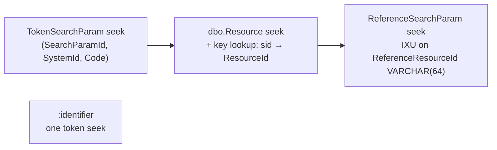

# Investigation: Reference `:identifier` Modifier and Identifier-Based Reference Search

**Feature**: search
**Status**: Implemented
**Created**: 2026-08-18
**Implemented**: 2026-08-18

## Problem Statement

A large share of real-world FHIR traffic searches by business identifier rather than by
server-assigned resource id, because callers hold an MRN, an NPI, or a facility-local
account number — not an Ignixa surrogate id. FHIR offers two spellings for this, separated
by a single character, and they are *not* the same query:

| Query | Mechanism | Reads |
|-------|-----------|-------|
| `GET /Encounter?patient.identifier=http://example.org/facilityA\|1234` | **chained search** (`.`) | resolves the reference, then tests `Patient.identifier` on the *target* |
| `GET /Encounter?patient:identifier=http://example.org/facilityA\|1234` | **`identifier` modifier** (`:`) | tests `Encounter.subject.identifier` on the *source*, never resolving anything |

The question this investigation answers: **can `Ignixa.Search.Sql` support the `:identifier`
modifier, or is indexing the referenced (child) resource a hard requirement?**

## Finding: indexing the child is not required

The `:identifier` modifier reads [`Reference.identifier`][ref-dt] — data that is already
inline in the *source* resource's own payload. It performs no join, no chain, and no
resolution of the target. The [spec's][search-spec] warning about "additional bookkeeping"
is a burden on the **data producer** (whoever writes the Encounter must keep
`subject.identifier` populated and current), not on the server's index.

So `:identifier` is, structurally, an ordinary **token search** that happens to be spelled
as a modifier on a reference parameter.

`Reference.identifier` requires a non-empty `value`; an identifier with a `system` but no
`value` indexes **nothing**. `TokenSearchParam.Code` is `NOT NULL`, so representing system-only
tokens would mean empty-string codes, changing `system|` query semantics and diverging from how
`Patient.identifier` already behaves.

[ref-dt]: https://hl7.org/fhir/references.html#Reference
[search-spec]: https://hl7.org/fhir/search.html#identifiercanonical

## Current State

Three independent gaps, none of them in the SQL compiler.

### 1. The write path discards `Reference.identifier` entirely

`src/Core/Ignixa.Search/Indexing/Converters/ResourceReferenceToReferenceSearchValueConverter.cs`

```csharp
protected override IEnumerable<ISearchValue> Convert(IElement value)
{
    string reference = value.Scalar("reference") as string;

    if (reference == null) yield break;   // <-- identifier-only reference: nothing indexed
    ...
}
```

`ReferenceSearchValue` (`src/Core/Ignixa.Search/Indexing/SearchValues/ReferenceSearchValue.cs`)
carries only `Kind`, `BaseUri`, `ResourceType`, `ResourceId`. It has no identifier field.

Consequence: a **logical reference** — a `Reference` with an `identifier` and no `reference`
string, which is entirely legal FHIR — is invisible to search today. This is a data-loss
gap, not merely a missing modifier.

### 2. The query path rejects the modifier at parse time

`src/Core/Ignixa.Search/Expressions/Parsers/SearchValueExpressionBuilderHelper.cs:155`

```csharp
void ISearchValueVisitor.Visit(ReferenceSearchValue reference)
{
    if (_modifier != null && _modifier.SearchModifierCode != SearchModifierCode.Type)
        ThrowModifierNotSupported();
    ...
}
```

`SearchModifierCode.Identifier` exists in the enum
(`src/Core/Ignixa.Specification/ValueSets/Normative/SearchModifierCode.cs:32`) but reaches
no handler, so `patient:identifier=...` fails with `SearchModifierNotSupportedException`.

### 3. The storage schema has no identifier columns on references

`src/DataLayer/Ignixa.DataLayer.SqlServer.Database/Tables/ReferenceSearchParam.sql`

```sql
CREATE TABLE dbo.ReferenceSearchParam (
    ResourceTypeId           SMALLINT      NOT NULL,
    ResourceSurrogateId      BIGINT        NOT NULL,
    SearchParamId            SMALLINT      NOT NULL,
    BaseUri                  VARCHAR (128) NULL,
    ReferenceResourceTypeId  SMALLINT      NULL,
    ReferenceResourceId      VARCHAR (64)  NOT NULL,   -- NOT NULL, and lead key of IXU_...
    ReferenceResourceVersion INT           NULL
);
```

This matches the Phase 9 completeness design's own note, which deferred the feature
explicitly:

> The `:identifier` reference modifier is not a compiler gap — it is a missing schema+write-path
> feature, out of place in a compiler-only phase.
> — `docs/superpowers/specs/2026-07-18-fhir-to-sql-compiler-phase9-completeness-design.md:31`

### What the SQL compiler already gives us

`Ignixa.Search.Sql` is **not** a constraint here:

- `SqlCatalog` is source-generated from the DDL — `Ignixa.Search.Sql.csproj:28` declares
  `<AdditionalFiles Include="..\..\DataLayer\Ignixa.DataLayer.SqlServer.Database\Tables\*.sql" />`,
  so any table or column added to the DDL appears in the catalog with no hand-written wiring.
- `ReferenceLoweringRule` and `TokenLoweringRule` are each a dozen lines over a
  `CteDefinition.ParamSource`. A token predicate against any registered search parameter id
  lowers with zero new compiler code.

## Cost of the chained alternative

For contrast, `Encounter?patient.identifier=X` today lowers through
`ChainLoweringRule` → `CteDefinition.ChainJoin` → `CteEmitter.EmitChainJoin`
(`src/Core/Ignixa.Search.Sql/Builders/CteEmitter.cs:218-239`):

```sql
SELECT DISTINCT rsp.ResourceTypeId AS T1, rsp.ResourceSurrogateId AS Sid1
FROM dbo.ReferenceSearchParam rsp
    INNER JOIN dbo.Resource r
        ON r.ResourceTypeId = rsp.ReferenceResourceTypeId
       AND r.ResourceId = rsp.ReferenceResourceId
    INNER JOIN cte0 m
        ON m.T1 = r.ResourceTypeId AND m.Sid1 = r.ResourceSurrogateId
WHERE ...
```

The inner match CTE yields **surrogate ids**, but `ReferenceSearchParam` is keyed on
**`ResourceId`** (`VARCHAR(64)`), so every chain must detour through `dbo.Resource` to
translate one into the other. And the index that serves that lookup —

```sql
CREATE UNIQUE NONCLUSTERED INDEX IX_Resource_ResourceTypeId_ResourceSurrgateId
    ON dbo.Resource(ResourceTypeId, ResourceSurrogateId) WHERE IsHistory = 0 AND IsDeleted = 0
```

— does **not** include `ResourceId`, so each matched target costs a key lookup into the
clustered index, whose rows carry `RawResource VARBINARY(MAX)`.



Three seeks plus a per-row key lookup, versus one seek.

## Options

### Option A — Add identifier columns to `ReferenceSearchParam`

Add `ReferenceIdentifierSystemId INT NULL` and
`ReferenceIdentifierValue VARCHAR(256) COLLATE Latin1_General_100_CS_AS NULL`, plus a
filtered index mirroring the existing token pattern:

```sql
CREATE INDEX IX_ReferenceSearchParam_SearchParamId_IdentifierSystemId_IdentifierValue
    ON dbo.ReferenceSearchParam(SearchParamId, ReferenceIdentifierSystemId, ReferenceIdentifierValue)
    INCLUDE(ResourceTypeId, ResourceSurrogateId)
    WHERE ReferenceIdentifierValue IS NOT NULL;
```

Precedent exists: `TokenSearchParam.IdentifierTypeCode` / `IdentifierTypeSystemId` were added
the same way and are populated by `PostMergeExtensionUpdater` after `MergeResources` commits.

| | |
|---|---|
| **For** | One table, one seek. Catalog picks the columns up automatically. |
| **Against** | `ReferenceResourceId` is `NOT NULL` **and** the lead key of `IXU_ReferenceResourceId_ReferenceResourceTypeId_SearchParamId_BaseUri_ResourceSurrogateId_ResourceTypeId`. Identifier-only logical references have no `ReferenceResourceId`, so supporting them requires making that column nullable and reworking the unique index — a migration on the hottest search table in the schema. Also widens every reference row for a sparse feature. |

### Option B — Reuse `TokenSearchParam` via a derived search parameter (**chosen**)

Register a derived `SearchParameterInfo` per reference parameter, canonical URL
`{originalParam.Url}#identifier`, type `Token`. At index time, emit `Reference.identifier`
as an ordinary `TokenSearchValue` under that derived parameter. At bind time, rewrite
`patient:identifier=sys|1234` into a plain token predicate against the derived parameter and
drop the modifier.

| | |
|---|---|
| **For** | **Zero schema change, zero TVP change, zero merge-SP change, zero compiler change.** Inherits `IX_TokenSearchParam_SearchParamId_SystemId_Code` → single seek. The derived parameter is an ordinary token parameter stored in `TokenSearchParam`, so it inherits token storage, indexing, `\|system\|value` value parsing, and `CodeOverflow` handling. The binder rewrites the single `:identifier` modifier and clears it, so modifier stacking on top of `:identifier` (for example, `patient:identifier:missing`) is not supported. Works identically on the in-memory/file-system data layer, because the entry is a normal token index entry. Covers identifier-only logical references, which are unrepresentable in Option A without the nullability migration. |
| **Against** | One extra `dbo.SearchParam` registry row per opted-in reference parameter (`SearchParamId` is `SMALLINT`; headroom must be confirmed). The derived parameter must be hidden from the `CapabilityStatement` and from user-facing parameter resolution, and must not be reachable as a chain target. Adding it changes `SearchParamHash`, so existing resources need reindexing to become findable by identifier. |

The derived parameter is deliberately inert for `_include`, `_revinclude`, chaining, and
compartments — which is correct, because a reference carrying only an identifier has no
resolvable target to include.

### Option C — Separate `ReferenceIdentifierSearchParam` table

Clean invariants, additive-only migration, no hot-path row widening. But it needs a new
TVP, a new `MergeResources` branch, a new row generator, and a new catalog entry — all of
Option B's benefits with substantially more plumbing and no additional capability.

### Option D — Denormalize the target's identifiers onto the referencing rows

This is the approach the spec explicitly warns about. It would make the *chained*
`patient.identifier=` a single seek, but editing one Patient's identifiers would require
rewriting index rows for every Observation, Encounter, and Condition that references it.
That needs a fan-out reindex job and has unbounded write amplification. Viable only as a
narrow, operator-configured allow-list of `(source parameter → identifier system)` pairs.
Rejected for now.

### Option E — Cover the surrogate-id → resource-id lookup (**chosen, independent**)

Add `INCLUDE(ResourceId)` to `IX_Resource_ResourceTypeId_ResourceSurrgateId`. This removes
the clustered-index key lookup from **every** chained search and every `_include`/`_revinclude`
expansion, not just identifier queries. Small, low-risk, and orthogonal to the choice above.

Delivered as a change to the decomposed DDL only
(`src/DataLayer/Ignixa.DataLayer.SqlServer.Database/Tables/Resource.sql`), which is both the
schema source of truth and the input `Ignixa.Search.Sql.csproj` source-generates `SqlCatalog`
from. Applying it to an existing database is the responsibility of whichever data layer
provisions the schema — see [Data layer requirements](#data-layer-requirements).

## Decision

**Option B + Option E.**

B delivers spec-correct `:identifier` at one index seek without migrating the hottest table
in the schema and without adding surface area to the merge path. E is an independent index
improvement that benefits all existing chain and include traffic and should land regardless.

A is the intuitive answer, but the `ReferenceResourceId NOT NULL` → nullable change on
`IXU_ReferenceResourceId_...` is real migration risk in exchange for a capability B already
provides. C is B with more moving parts. D is a last resort.

## Scope

The capability is owned by two libraries:

| Project | Role |
|---|---|
| `Ignixa.Search` | Derived parameter registration (`ReferenceIdentifierSearchParameterFactory`, `ReferenceIdentifierSearchParameterRegistrar`), the `Reference` → `TokenSearchValue` converter, the `:identifier` → derived-parameter substitution in `SearchKeyBinder`, and `SearchParameterUriComparer` |
| `Ignixa.Search.Sql` | The `ReferenceLoweringRule` modifier guard (below). No other compiler change was needed — after substitution this is an ordinary token search |

Outside those, only three small things change: two leak guards keeping derived parameters out
of the `CapabilityStatement` and the GraphQL schema, a hash merge in
`CompositeSearchParameterDefinitionManager` so package-derived parameters are reflected, and
the Option E DDL line.

Deliberately **no** data-layer implementation is part of this change. The SQL Entity Framework
data layer is being retired, so the id-assignment work this feature needs is specified in
[Data layer requirements](#data-layer-requirements) rather than implemented against a project
that is going away.

### The `Ignixa.Search.Sql` boundary guard

`ReferenceLoweringRule` previously ignored `predicate.Modifier` entirely, so any modifier
reaching it was silently discarded and the query degraded to a plain reference equality —
wrong rows, no diagnostic. It now accepts only a null modifier and `SearchModifierCode.Type`
(a no-op by that point, because the binder has already folded the named type into the
`ReferenceSearchValue`), and throws `NotSupportedException` for everything else.

This matters because `Ignixa.Search.Sql` ships as a standalone package and its guards exist
to defend IR built directly against the compiler API, not just IR produced by the binder.
`:identifier` is rewritten upstream and must never arrive here; if it does, that is
hand-built IR and refusing is correct. The rule now matches `TokenLoweringRule`, which has
always thrown on `SearchModifierCode.Identifier` for exactly this reason.

## Data layer requirements

A data layer must satisfy these for `:identifier` to work against it. Neither is implemented
here.

1. **Assign an id to derived parameter URLs.** Derived parameters are ordinary token
   parameters, but their canonical URLs carry an `#identifier` fragment. Any storage that maps
   search parameter URL → numeric id must include them, and must compare URLs
   **fragment-sensitively** — .NET's `Uri.Equals` ignores fragments, so a naive `Uri`-keyed
   dictionary will alias `{url}#identifier` onto `{url}` and silently mis-key every derived
   row. Use `SearchParameterUriComparer.Instance`. A storage layer that skips rows for
   unknown parameter urls will otherwise drop every derived index row with no error.
2. **Reindex existing resources.** Registering derived parameters changes the search parameter
   hash. Resources indexed before deployment carry no derived token rows, so `:identifier`
   returns **incomplete** results — silently missing pre-existing resources — rather than
   erroring, until they are rewritten or reindexed.

Both are storage concerns, not search concerns: the in-memory and file-system paths need
neither, because they match index entries by `SearchParameter.Name` directly.

## Consequences

- **Reindex/backfill limitation.** Existing resources are **not** backfilled. `:identifier`
  only matches resources written or rewritten after this change is deployed, and returns
  **incomplete** results rather than erroring in the meantime. See
  [Data layer requirements](#data-layer-requirements) — this is a storage concern, and no
  hash-driven reindex mechanism is currently wired up in this repository for any search
  parameter.
- The derived parameter must be excluded from `CapabilityStatement.rest.resource.searchParam`
  and from `$reindex` user-facing reporting.
- `:identifier` returns only resources whose payload literally carries `Reference.identifier`.
  It is not a substitute for chained `.identifier`, and both must remain available.

## Follow-ups

- **Data layer support** — the two items in
  [Data layer requirements](#data-layer-requirements) must be implemented by whichever data
  layer replaces the retiring SQL Entity Framework project, or `:identifier` will silently
  return nothing on it.
- **Apply the Option E index to existing databases** — the DDL carries `INCLUDE(ResourceId)`,
  but provisioning it on an already-deployed database needs an online index replacement
  (`CREATE ... WITH (DROP_EXISTING = ON, ONLINE = ON)`; `dbo.Resource` is the largest table in
  the schema, so an offline rebuild would block writes for its duration).
- **Modifier guards on the remaining leaf lowering rules** — `DateTimeLoweringRule`,
  `NumberLoweringRule`, and `QuantityLoweringRule` still ignore `predicate.Modifier` and would
  silently degrade to plain equality, the same defect just fixed in `ReferenceLoweringRule`.
  Pre-existing and unrelated to this feature, but the same wrong-rows-no-diagnostic class.
- **Per-resource LINQ iterator allocation in `SupportedSearchParameterDefinitionManager.GetSearchParameters`**
  — pre-existing (the file was last modified in commit `6b72e6a3`) and needs measurement
  before optimising.
- **`Ignixa.RepoGuards.Tests.GitIgnoreSourcePathsTests` worktree failure** — `FindRepoRoot()`
  requires a `.git` directory, but `.git` is a file in a git worktree; fix by accepting both
  `File.Exists(".git")` and `Directory.Exists(".git")`, or by using `git rev-parse --show-toplevel`.

## References

- FHIR R4 Search — [Canonical Identifiers](https://hl7.org/fhir/search.html#identifiercanonical)
- FHIR R4 — [Reference datatype](https://hl7.org/fhir/references.html#Reference)
- `docs/superpowers/specs/2026-07-18-fhir-to-sql-compiler-phase9-completeness-design.md` §5
