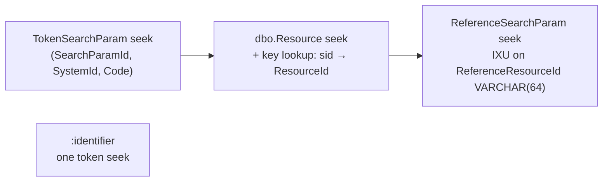

# Investigation: Reference `:identifier` Modifier and Identifier-Based Reference Search

**Feature**: search
**Status**: Implemented
**Created**: 2026-08-18
**Implemented**: 2026-08-18

## Problem Statement

A large share of real-world FHIR traffic searches by business identifier rather than by
server-assigned resource id, because callers hold an MRN, an NPI, or a facility-local
account number — not an Ignixa surrogate id. FHIR offers two spellings for this, separated
by a single character, and they are *not* the same query:

| Query | Mechanism | Reads |
|-------|-----------|-------|
| `GET /Encounter?patient.identifier=http://example.org/facilityA\|1234` | **chained search** (`.`) | resolves the reference, then tests `Patient.identifier` on the *target* |
| `GET /Encounter?patient:identifier=http://example.org/facilityA\|1234` | **`identifier` modifier** (`:`) | tests `Encounter.subject.identifier` on the *source*, never resolving anything |

The question this investigation answers: **can `Ignixa.Search.Sql` support the `:identifier`
modifier, or is indexing the referenced (child) resource a hard requirement?**

## Finding: indexing the child is not required

The `:identifier` modifier reads [`Reference.identifier`][ref-dt] — data that is already
inline in the *source* resource's own payload. It performs no join, no chain, and no
resolution of the target. The [spec's][search-spec] warning about "additional bookkeeping"
is a burden on the **data producer** (whoever writes the Encounter must keep
`subject.identifier` populated and current), not on the server's index.

So `:identifier` is, structurally, an ordinary **token search** that happens to be spelled
as a modifier on a reference parameter.

`Reference.identifier` requires a non-empty `value`; an identifier with a `system` but no
`value` indexes **nothing**. `TokenSearchParam.Code` is `NOT NULL`, so representing system-only
tokens would mean empty-string codes, changing `system|` query semantics and diverging from how
`Patient.identifier` already behaves.

[ref-dt]: https://hl7.org/fhir/references.html#Reference
[search-spec]: https://hl7.org/fhir/search.html#identifiercanonical

## Current State

Three independent gaps, none of them in the SQL compiler.

### 1. The write path discards `Reference.identifier` entirely

`src/Core/Ignixa.Search/Indexing/Converters/ResourceReferenceToReferenceSearchValueConverter.cs`

```csharp
protected override IEnumerable<ISearchValue> Convert(IElement value)
{
    string reference = value.Scalar("reference") as string;

    if (reference == null) yield break;   // <-- identifier-only reference: nothing indexed
    ...
}
```

`ReferenceSearchValue` (`src/Core/Ignixa.Search/Indexing/SearchValues/ReferenceSearchValue.cs`)
carries only `Kind`, `BaseUri`, `ResourceType`, `ResourceId`. It has no identifier field.

Consequence: a **logical reference** — a `Reference` with an `identifier` and no `reference`
string, which is entirely legal FHIR — is invisible to search today. This is a data-loss
gap, not merely a missing modifier.

### 2. The query path rejects the modifier at parse time

`src/Core/Ignixa.Search/Expressions/Parsers/SearchValueExpressionBuilderHelper.cs:155`

```csharp
void ISearchValueVisitor.Visit(ReferenceSearchValue reference)
{
    if (_modifier != null && _modifier.SearchModifierCode != SearchModifierCode.Type)
        ThrowModifierNotSupported();
    ...
}
```

`SearchModifierCode.Identifier` exists in the enum
(`src/Core/Ignixa.Specification/ValueSets/Normative/SearchModifierCode.cs:32`) but reaches
no handler, so `patient:identifier=...` fails with `SearchModifierNotSupportedException`.

### 3. The storage schema has no identifier columns on references

`src/DataLayer/Ignixa.DataLayer.SqlServer.Database/Tables/ReferenceSearchParam.sql`

```sql
CREATE TABLE dbo.ReferenceSearchParam (
    ResourceTypeId           SMALLINT      NOT NULL,
    ResourceSurrogateId      BIGINT        NOT NULL,
    SearchParamId            SMALLINT      NOT NULL,
    BaseUri                  VARCHAR (128) NULL,
    ReferenceResourceTypeId  SMALLINT      NULL,
    ReferenceResourceId      VARCHAR (64)  NOT NULL,   -- NOT NULL, and lead key of IXU_...
    ReferenceResourceVersion INT           NULL
);
```

This matches the Phase 9 completeness design's own note, which deferred the feature
explicitly:

> The `:identifier` reference modifier is not a compiler gap — it is a missing schema+write-path
> feature, out of place in a compiler-only phase.
> — `docs/superpowers/specs/2026-07-18-fhir-to-sql-compiler-phase9-completeness-design.md:31`

### What the SQL compiler already gives us

`Ignixa.Search.Sql` is **not** a constraint here:

- `SqlCatalog` is source-generated from the DDL — `Ignixa.Search.Sql.csproj:28` declares
  `<AdditionalFiles Include="..\..\DataLayer\Ignixa.DataLayer.SqlServer.Database\Tables\*.sql" />`,
  so any table or column added to the DDL appears in the catalog with no hand-written wiring.
- `ReferenceLoweringRule` and `TokenLoweringRule` are each a dozen lines over a
  `CteDefinition.ParamSource`. A token predicate against any registered search parameter id
  lowers with zero new compiler code.

## Cost of the chained alternative

For contrast, `Encounter?patient.identifier=X` today lowers through
`ChainLoweringRule` → `CteDefinition.ChainJoin` → `CteEmitter.EmitChainJoin`
(`src/Core/Ignixa.Search.Sql/Builders/CteEmitter.cs:218-239`):

```sql
SELECT DISTINCT rsp.ResourceTypeId AS T1, rsp.ResourceSurrogateId AS Sid1
FROM dbo.ReferenceSearchParam rsp
    INNER JOIN dbo.Resource r
        ON r.ResourceTypeId = rsp.ReferenceResourceTypeId
       AND r.ResourceId = rsp.ReferenceResourceId
    INNER JOIN cte0 m
        ON m.T1 = r.ResourceTypeId AND m.Sid1 = r.ResourceSurrogateId
WHERE ...
```

The inner match CTE yields **surrogate ids**, but `ReferenceSearchParam` is keyed on
**`ResourceId`** (`VARCHAR(64)`), so every chain must detour through `dbo.Resource` to
translate one into the other. And the index that serves that lookup —

```sql
CREATE UNIQUE NONCLUSTERED INDEX IX_Resource_ResourceTypeId_ResourceSurrgateId
    ON dbo.Resource(ResourceTypeId, ResourceSurrogateId) WHERE IsHistory = 0 AND IsDeleted = 0
```

— does **not** include `ResourceId`, so each matched target costs a key lookup into the
clustered index, whose rows carry `RawResource VARBINARY(MAX)`.


```mermaid
graph LR
  A["TokenSearchParam seek<br/>(SearchParamId, SystemId, Code)"] --> B["dbo.Resource seek<br/>+ key lookup: sid → ResourceId"]
  B --> C["ReferenceSearchParam seek<br/>IXU on ReferenceResourceId VARCHAR(64)"]
  D[":identifier<br/>one token seek"]
```

Three seeks plus a per-row key lookup, versus one seek.

## Options

### Option A — Add identifier columns to `ReferenceSearchParam`

Add `ReferenceIdentifierSystemId INT NULL` and
`ReferenceIdentifierValue VARCHAR(256) COLLATE Latin1_General_100_CS_AS NULL`, plus a
filtered index mirroring the existing token pattern:

```sql
CREATE INDEX IX_ReferenceSearchParam_SearchParamId_IdentifierSystemId_IdentifierValue
    ON dbo.ReferenceSearchParam(SearchParamId, ReferenceIdentifierSystemId, ReferenceIdentifierValue)
    INCLUDE(ResourceTypeId, ResourceSurrogateId)
    WHERE ReferenceIdentifierValue IS NOT NULL;
```

Precedent exists: `TokenSearchParam.IdentifierTypeCode` / `IdentifierTypeSystemId` were added
the same way and are populated by `PostMergeExtensionUpdater` after `MergeResources` commits.

| | |
|---|---|
| **For** | One table, one seek. Catalog picks the columns up automatically. |
| **Against** | `ReferenceResourceId` is `NOT NULL` **and** the lead key of `IXU_ReferenceResourceId_ReferenceResourceTypeId_SearchParamId_BaseUri_ResourceSurrogateId_ResourceTypeId`. Identifier-only logical references have no `ReferenceResourceId`, so supporting them requires making that column nullable and reworking the unique index — a migration on the hottest search table in the schema. Also widens every reference row for a sparse feature. |

### Option B — Reuse `TokenSearchParam` via a derived search parameter (**chosen**)

Register a derived `SearchParameterInfo` per reference parameter, canonical URL
`{originalParam.Url}#identifier`, type `Token`. At index time, emit `Reference.identifier`
as an ordinary `TokenSearchValue` under that derived parameter. At bind time, rewrite
`patient:identifier=sys|1234` into a plain token predicate against the derived parameter and
drop the modifier.

The derived parameter's expression is the source expression narrowed to the identifier,
`({expression}).select(ofType(Reference) | ofType(CodeableReference).reference).identifier`, so
the selected elements are `Identifier`s and go through the existing `Identifier` →
`TokenSearchValue` converter. The `ofType(CodeableReference).reference` branch is defensive: no
shipped R5/R6 reference parameter needs it (every generated one touching a `CodeableReference`
element already narrows its own expression to `.reference`, e.g. `CarePlan.addresses.reference`),
but a custom or IG-provided reference parameter can select the bare `CodeableReference` node, the
shape `CodeableReferenceToReferenceSearchValueConverter` exists to index. `ofType(CodeableReference)`
is safe on STU3/R4/R4B, where the type does not exist, because `ElementSearchIndexer.Extract`
evaluates without a FHIRPath schema and `ofType()`'s type-identifier check no-ops when the schema
is null, so it matches nothing there rather than throwing. An earlier revision kept the
source expression unchanged and added a `Reference` → `TokenSearchValue` converter instead. That
was wrong: converters are keyed by element type and search value type only, so the new converter
also answered for every declared token parameter or composite component that selects a
`Reference`. `ElementSearchIndexer` only falls back to type inference for a composite component
when that lookup fails, so `DocumentReference-relationship` — whose shipped definition pairs the
Token `relation` definition with the `target` Reference — silently stopped indexing in every FHIR
version. It also logged a converter-gap warning for every canonical, uri, attachment or resource a
reference parameter selects, none of which carries a `Reference.identifier`. The resource-backed
Firely parity sweep caught both.

| | |
|---|---|
| **For** | **Zero schema change, zero TVP change, zero merge-SP change, zero compiler change.** Inherits `IX_TokenSearchParam_SearchParamId_SystemId_Code` → single seek. The derived parameter is an ordinary token parameter stored in `TokenSearchParam`, so it inherits token storage, indexing, `\|system\|value` value parsing, and `CodeOverflow` handling. The binder rewrites the single `:identifier` modifier and clears it, so modifier stacking on top of `:identifier` (for example, `patient:identifier:missing`) is not supported. Works identically on the in-memory/file-system data layer, because the entry is a normal token index entry. Covers identifier-only logical references, which are unrepresentable in Option A without the nullability migration. |
| **Against** | One extra `dbo.SearchParam` registry row per opted-in reference parameter (`SearchParamId` is `SMALLINT`; headroom must be confirmed). The derived parameter must be hidden from the `CapabilityStatement` and from user-facing parameter resolution, and must not be reachable as a chain target. Adding it changes `SearchParamHash`, so existing resources need reindexing to become findable by identifier. |

The derived parameter is deliberately inert for `_include`, `_revinclude`, chaining, and
compartments — which is correct, because a reference carrying only an identifier has no
resolvable target to include.

### Honoring `Reference.type` in type-filtered derived expressions

Several reference parameters narrow a polymorphic reference field with `resolve() is X`, for
example `clinical-patient`'s Encounter branch,
`Encounter.subject.where(resolve() is Patient)`. `resolve()` needs `Reference.reference` to look
anything up (`FhirSpecificFunctions.Resolve`/`ExtractReferenceValue`,
`LightweightReferenceToElementResolver`); a LOGICAL reference that carries only `identifier`
(optionally with `type`) has nothing for `resolve()` to resolve, so it never satisfied the type
test, and its identifier was never indexed under the derived parameter — defeating the main
real-world use of the modifier, `GET /Encounter?patient:identifier=http://example.org/facilityA|1234`.

`ReferenceIdentifierSearchParameterFactory.DeriveExpression` now rewrites every `resolve() is X`
occurrence in the source expression, for the derived `:identifier` expression only, to also accept
a reference whose own `Reference.type` names `X`:

```text
resolve() is X
  → (resolve() is X or type = 'X' or type = 'http://hl7.org/fhir/StructureDefinition/X')
```

Both the relative (`Patient`) and absolute canonical (`http://hl7.org/fhir/StructureDefinition/Patient`)
forms are checked because `Reference.type` is a `uri` and the spec allows either
(https://hl7.org/fhir/references.html#Reference: `type` is "the expected type of the target";
a relative reference is relative to `http://hl7.org/fhir/StructureDefinition/`). The rewrite is
applied only to the derived expression — the FHIRPath engine, `resolve()`, the lightweight
resolver, and every source (non-derived) reference parameter's own expression are unchanged, so a
type-filtered reference search *without* the `:identifier` modifier still requires `resolve()` to
succeed, exactly as the spec defines.

**Shape census.** Every generated base search parameter across STU3/R4/R4B/R5/R6 was surveyed for
`resolve()` type tests. Exactly one shape occurs: the infix operator `resolve() is TypeName`,
always immediately inside a `.where(...)` call and never combined with another predicate in the
same `where()` — 232 occurrences total (0 STU3, 50 R4, 53 R4B, 64 R5, 65 R6) across 8 distinct
target types (`Patient`, `Group`, `Location`, `Practitioner`, `RelatedPerson`, `Encounter`,
`Device`, `MedicinalProductDefinition`). No occurrence uses the function-call form
(`resolve().is(X)`), a type cast (`resolve() as X`), a namespaced identifier (`resolve() is
FHIR.X`), or an `or`-chain of multiple `is` tests inside one `where()`; a few unrelated `resolve()`
calls exist purely for further navigation with no type test at all (e.g. R6's
`Specimen.container.device.resolve().location`) and are untouched because there is nothing to
rewrite. Every base path preceding `.where(resolve() is X)` (`.subject`, `.actor`, `.target`,
`.for`, `.careManager`, `.who`, `.what`, `.device`, …) is a plain identity/participant `Reference`
element in the FHIR spec, never a `CodeableReference`, so the `type = ...` alternatives always
evaluate against the same `Reference` focus `resolve()` already operates on inside `where(...)`.

The rewrite is implemented as a single compiled regex (`[GeneratedRegex]`) rather than by parsing
the expression into an `Ignixa.FhirPath` AST and reserializing it: the census above found exactly
one uniform shape, and every `Expression.ToString()` override in `Ignixa.FhirPath.Expressions`
re-parenthesizes unconditionally, so a full AST round-trip would reformat every reference
parameter's derived expression — including the ~96% that contain no `resolve() is` test at all —
for no behavioral gain. See the XML-doc remarks on
`ReferenceIdentifierSearchParameterFactory.HonorReferenceType` for the full shape-by-shape
justification, including why a namespaced identifier fails safe (does not match) instead of being
rewritten against a truncated prefix.

**Literal- and comment-awareness, and a linear-time guarantee.** The census above was built from
the generated *base* search parameters only. The rewrite, however, runs for every Reference-typed
search parameter that gains a derived `:identifier` parameter — including a custom or IG-package
parameter reached through `CompositeSearchParameterDefinitionManager`'s derived-parameter inclusion
— whose FHIRPath is not constrained to the census's shapes. A naive text-only rewrite would also
match `resolve() is TypeName` when it appears as plain text inside a FHIRPath comment (`//` or
`/* */`), a string literal (e.g. `Patient.name.where(text = 'resolve() is Patient')`, which
compares a name against that literal string, not an actual type test), or a legacy double-quoted or
backtick-delimited identifier, corrupting the literal and producing a derived expression that fails
to parse. `ResolveTypeTestOrLiteralPattern` guards against this by matching a whole comment, string
literal, double-quoted identifier, or backtick identifier as its own alternative ahead of the
`resolve() is TypeName` alternative; regex alternation resolves the leftmost starting position
first and commits to whichever alternative matches there, so an opening `//`, `/*`, quote, or
backtick is claimed by its own alternative before the `resolve() is` alternative can look inside
it. `HonorReferenceType`'s `MatchEvaluator` passes every such match through unchanged (none of them
populate the `type` capture) and only rewrites a `resolve() is TypeName` match found outside of
them.

Each skip alternative wraps its body in an atomic group and falls back to matching end-of-input
when unclosed, which is what makes matching linear rather than quadratic in input length: an
earlier version of this pattern had no comment alternative and used ordinary backtracking
repetition for its string alternative, so an unclosed quote inside what is actually a `//` comment
(legal FHIRPath, e.g. `Observation.subject // '\'\'\'...`) cost time quadratic in the comment's
length. A `[GeneratedRegex]` match timeout, plus a fail-safe catch in `HonorReferenceType` that
returns the source expression unchanged, now also bounds the worst case as defense in depth. The
`resolve() is TypeName` alternative additionally requires that `resolve` not be immediately
preceded by a word character, `.`, `$`, or `%`, so a dotted receiver such as
`subject.resolve() is Patient` is left unrewritten — rewriting it would splice a parenthesized
expression directly after a `.`, which does not parse, and would in any case need `type` evaluated
against the wrong focus.

Per the FHIRPath N1 grammar, a backslash escape is `\` followed by one of `` `'"\/fnrt `` or
`\uXXXX`; the doubled quote `''` is *not* a spec-defined escape — it is tolerated only because
`FhirPathTokenizer`'s own string-literal regex accepts it, and the string alternative mirrors that
tokenizer rather than the spec grammar for exactly that reason. The backtick alternative
intentionally has no escape handling, matching `FhirPathTokenizer`'s own backtick regex, where the
next backtick always closes the identifier. See the XML-doc remarks on
`ReferenceIdentifierSearchParameterFactory.ResolveTypeTestOrLiteralPattern` for the single, complete
copy of this explanation; `HonorReferenceType`'s own remarks reference it rather than repeating it.

### Option C — Separate `ReferenceIdentifierSearchParam` table

Clean invariants, additive-only migration, no hot-path row widening. But it needs a new
TVP, a new `MergeResources` branch, a new row generator, and a new catalog entry — all of
Option B's benefits with substantially more plumbing and no additional capability.

### Option D — Denormalize the target's identifiers onto the referencing rows

This is the approach the spec explicitly warns about. It would make the *chained*
`patient.identifier=` a single seek, but editing one Patient's identifiers would require
rewriting index rows for every Observation, Encounter, and Condition that references it.
That needs a fan-out reindex job and has unbounded write amplification. Viable only as a
narrow, operator-configured allow-list of `(source parameter → identifier system)` pairs.
Rejected for now.

### Option E — Cover the surrogate-id → resource-id lookup (**chosen, independent**)

Add `INCLUDE(ResourceId)` to `IX_Resource_ResourceTypeId_ResourceSurrgateId`. This removes
the clustered-index key lookup from **every** chained search and every `_include`/`_revinclude`
expansion, not just identifier queries. Small, low-risk, and orthogonal to the choice above.

Delivered as a change to the decomposed DDL only
(`src/DataLayer/Ignixa.DataLayer.SqlServer.Database/Tables/Resource.sql`), which is both the
schema source of truth and the input `Ignixa.Search.Sql.csproj` source-generates `SqlCatalog`
from. It ships as schema **v4** (`SchemaVersionConstants.CurrentVersion`).

**Rollout risk.** Applying an `INCLUDE` column to an existing nonclustered index is a
drop-and-recreate, not an in-place alter, and the index has no `ONLINE = ON` option in the DDL.
`DeployReportClassifier` classifies this change `AutoSafe` (no `DataIssue` columns are reported
for an index rebuild), so `UpgradeIfNeededAsync` applies it automatically during an existing
tenant's automatic schema upgrade with no operator gate. On SQL Server, dropping and recreating a
nonclustered index takes a schema-modification (**Sch-M**) lock on `dbo.Resource` for the
rebuild's duration — the largest table in the schema — blocking reads and writes against it for
every tenant sharing that database, not only the one being upgraded. This is a genuine operational
trade against Option E's independent benefit, and is worth watching on first deployment to a
database whose `dbo.Resource` is large enough for the rebuild to take noticeable wall-clock time;
`ONLINE = ON` (Enterprise/Azure SQL) would remove the lock but is not applied today.

## Decision

**Option B + Option E.**

B delivers spec-correct `:identifier` at one index seek without migrating the hottest table
in the schema and without adding surface area to the merge path. E is an independent index
improvement that benefits all existing chain and include traffic and should land regardless.

A is the intuitive answer, but the `ReferenceResourceId NOT NULL` → nullable change on
`IXU_ReferenceResourceId_...` is real migration risk in exchange for a capability B already
provides. C is B with more moving parts. D is a last resort.

## Scope

The capability is owned by two libraries:

| Project | Role |
|---|---|
| `Ignixa.Search` | Derived parameter registration (`ReferenceIdentifierSearchParameterFactory`, which also derives the identifier-narrowed expression, and `ReferenceIdentifierSearchParameterRegistrar`), the `:identifier` → derived-parameter substitution in `SearchKeyBinder`, and `SearchParameterUriComparer` |
| `Ignixa.Search.Sql` | The `ReferenceLoweringRule` modifier guard (below). No other compiler change was needed — after substitution this is an ordinary token search |

Outside those, several more things change, beyond the two obvious leak guards keeping derived
parameters out of the `CapabilityStatement` and the GraphQL schema:

- **`SearchParameterInfo.Equals`/`GetHashCode`** (`Ignixa.Search.Models`) now compare `Url` through
  `SearchParameterUriComparer.Instance` instead of `Uri.Equals`, i.e. fragment-sensitively. Without
  this, `{url}` and the derived `{url}#identifier` would hash and compare equal (`Uri.Equals`
  ignores fragments), colliding two distinct parameters in anything keyed by `SearchParameterInfo`
  identity.
- **`SearchParameterDefinitionManager`'s snapshot publishing** (`Ignixa.Search.Definition`) — its
  `_snapshot` field (`RegistrySnapshot`) is rebuilt and swapped in by `PublishSnapshot()` every time
  parameters are added or deleted; registering the derived `:identifier` parameters through
  `ReferenceIdentifierSearchParameterRegistrar` goes through that same add path, so they show up in
  `AllSearchParameters` and the `ByUrl`/`ByResourceType` lookups like any other parameter, with no
  bespoke snapshot handling of its own.
- **`CompositeSearchParameterDefinitionManager`'s derived-URL fallback and on-demand hash**
  (`Ignixa.Application.Features.Search`) — its `TryGetSearchParameter` calls
  `ReferenceIdentifierSearchParameterFactory.TryGetSourceUrl` and, if the requested URL is a
  derived one not already registered in the base manager, calls
  `ReferenceIdentifierSearchParameterFactory.Create` on the source parameter to construct it on the
  fly; this is what makes a custom or IG-package reference parameter's `:identifier` sibling
  resolvable without every derived URL needing its own pre-registered row. Because that on-the-fly
  parameter isn't in the cached `SearchParameterHashMap`, `GetSearchParameterHashForResourceType`
  recomputes the hash on demand (`parameters.CalculateSearchParameterHash()`) for a resource type
  whose parameter set includes one, rather than trusting the cached map.
- **`InternalsVisibleTo("Ignixa.Application")`** on `Ignixa.Search` (`Properties/AssemblyInfo.cs`)
  — added so `Ignixa.Application`'s composite manager and tests can reach the internal pieces of
  this feature that are not meant to be public API.
- **Schema v4** — the Option E DDL line below bumps `SchemaVersionConstants.CurrentVersion`.

The derived parameter's id-assignment requirement (below) is satisfied by
`Ignixa.DataLayer.SqlServer`, which superseded the EF-based `Ignixa.DataLayer.SqlEntityFramework`
project this investigation originally deferred that work to; the reindex requirement remains open
— see [Data layer requirements](#data-layer-requirements).

### The `Ignixa.Search.Sql` boundary guard

`ReferenceLoweringRule` previously ignored `predicate.Modifier` entirely, so any modifier
reaching it was silently discarded and the query degraded to a plain reference equality —
wrong rows, no diagnostic. It now accepts only a null modifier and `SearchModifierCode.Type`
(a no-op by that point, because the binder has already folded the named type into the
`ReferenceSearchValue`), and throws `NotSupportedException` for everything else.

This matters because `Ignixa.Search.Sql` ships as a standalone package and its guards exist
to defend IR built directly against the compiler API, not just IR produced by the binder.
`:identifier` is rewritten upstream and must never arrive here; if it does, that is
hand-built IR and refusing is correct. The rule now matches `TokenLoweringRule`, which has
always thrown on `SearchModifierCode.Identifier` for exactly this reason.

## Data layer requirements

A data layer must satisfy these for `:identifier` to work against it.

1. **Assign an id to derived parameter URLs.** Derived parameters are ordinary token
   parameters, but their canonical URLs carry an `#identifier` fragment. Any storage that maps
   search parameter URL → numeric id must include them, and must compare URLs
   **fragment-sensitively** — .NET's `Uri.Equals` ignores fragments, so a naive `Uri`-keyed
   dictionary will alias `{url}#identifier` onto `{url}` and silently mis-key every derived
   row. Use `SearchParameterUriComparer.Instance`. A storage layer that skips rows for
   unknown parameter urls will otherwise drop every derived index row with no error.

   **Satisfied by `Ignixa.DataLayer.SqlServer`.** The EF-based `Ignixa.DataLayer.SqlEntityFramework`
   project this requirement was originally written against has since been retired in favour of
   `Ignixa.DataLayer.SqlServer`, which maps parameters to `dbo.SearchParam` ids with ordinal
   **string** keys taken from `Url.ToString()` — fragment-preserving, unlike `Uri.Equals`:
   - `RowGenerators/SearchParameterIdLookupHelper.TryGetSearchParamId` — the row-generator lookup
     every `ISearchParameterRowGenerator` calls; a miss is logged and the row is skipped, never
     silently mis-keyed onto the base parameter.
   - `Search/SqlServerSymbolResolver.GetSearchParamIdAsync` — the query-compile-time lookup,
     delegating to the cache below with the same string key.
   - `Indexing/SqlServerSearchIndexReferenceDataCache` — owns the `_searchParamCache`
     (`Dictionary<string, short>`), seeded from `seedDefinitions.AllSearchParameters.Concat(
     _searchParameterDefinitionManager.AllSearchParameters)` (which already include derived
     parameters via `SearchParameterUriComparer`-grouped registration), and upserted through
     `dbo.UpsertSearchParams`.

   `test/Ignixa.DataLayer.SqlServer.IntegrationTests/ReferenceIdentifierSearchParamSeedingTests.cs`
   covers this end to end: it seeds a reference parameter's derived `#identifier` sibling through
   the real cache, asserts its own `dbo.SearchParam` row (distinct from the base parameter's),
   writes a resource indexed under it through `SqlServerMergeRepository`, and asserts the resulting
   `dbo.TokenSearchParam` row carries that same id. Mutation-checked: commenting out
   `ReferenceIdentifierSearchParameterRegistrar.Register` in `SearchParameterDefinitionManager`'s
   constructor turns the assertion red.
2. **Reindex existing resources.** Registering derived parameters changes the search parameter
   hash. Resources indexed before deployment carry no derived token rows, so `:identifier`
   returns **incomplete** results — silently missing pre-existing resources — rather than
   erroring, until they are rewritten or reindexed.

   **Still unimplemented.** `Ignixa.DataLayer.SqlServer.Database` has reindex-job *schema*
   scaffolding — `Tables/ReindexJob.sql` and the `AcquireReindexJobs` / `CreateReindexJob` /
   `GetReindexJobById` / `UpdateReindexJob` stored procedures, with
   `ActiveSearchParameter.ReindexJobId` tracking the association — but nothing in
   `Ignixa.DataLayer.SqlServer`'s C# calls any of those four procedures: there is no code path
   that creates, acquires, or drives a reindex job to completion. Registering `:identifier` on an
   existing tenant is exactly the scenario requirement 2 describes, and remains a silent,
   unbounded-duration gap until a reindex execution path is built against this scaffolding.

Requirement 1 is a storage concern unique to a numeric-id-keyed data layer: the file-system path
matches index entries by `SearchParameter.Name` directly, so it has no id-lookup table to keep
fragment-sensitive and needs nothing extra here. Requirement 2 is **not** exempt on this path.
`FileBasedFhirRepository` computes `SearchIndexes` once, at write time, and persists that snapshot
into the resource's metadata JSON (`SearchIndexes = resource.SearchIndices?.Cast<SearchIndexEntry>()
.ToList()`, `CreateOrUpdateAsync` and the batch path `BatchWriteAsync`); a later read (`GetResourceMetadataAsync`) loads that persisted
snapshot rather than recomputing it. A resource written to the file-system data layer before
`:identifier` was registered therefore carries no derived token entries on disk either, and needs
the same backfill every other data layer does — see
[Data layer requirements](#data-layer-requirements) item 2.

## Consequences

- **Reindex/backfill limitation.** Existing resources are **not** backfilled. `:identifier`
  only matches resources written or rewritten after this change is deployed, and returns
  **incomplete** results rather than erroring in the meantime. See
  [Data layer requirements](#data-layer-requirements) — `Ignixa.DataLayer.SqlServer` has
  reindex-job schema scaffolding (`dbo.ReindexJob` and its stored procedures) but no code path
  that drives a job to completion, so no hash-driven reindex mechanism is wired up today for
  `:identifier` or any other search parameter.
- The derived parameter must be excluded from `CapabilityStatement.rest.resource.searchParam`
  and from `$reindex` user-facing reporting.
- `:identifier` returns only resources whose payload literally carries `Reference.identifier`.
  It is not a substitute for chained `.identifier`, and both must remain available.

## Follow-ups

- **Reindex execution path** — build the missing piece of
  [Data layer requirements](#data-layer-requirements) item 2: a code path in
  `Ignixa.DataLayer.SqlServer` (or the background-jobs layer above it) that creates, acquires,
  and drives a `dbo.ReindexJob` to completion against the existing schema scaffolding, so
  registering `:identifier` — or any other search parameter — on a tenant with existing
  resources stops silently returning incomplete results.
- **Modifier guards on the remaining leaf lowering rules** — `DateTimeLoweringRule`,
  `NumberLoweringRule`, and `QuantityLoweringRule` still ignore `predicate.Modifier` and would
  silently degrade to plain equality, the same defect just fixed in `ReferenceLoweringRule`.
  Pre-existing and unrelated to this feature, but the same wrong-rows-no-diagnostic class.
- **Per-resource LINQ iterator allocation in `SupportedSearchParameterDefinitionManager.GetSearchParameters`**
  — pre-existing (the file was last modified in commit `6b72e6a3`) and needs measurement
  before optimising.
- **`Ignixa.RepoGuards.Tests.GitIgnoreSourcePathsTests` worktree failure** — `FindRepoRoot()`
  requires a `.git` directory, but `.git` is a file in a git worktree; fix by accepting both
  `File.Exists(".git")` and `Directory.Exists(".git")`, or by using `git rev-parse --show-toplevel`.

## References

- FHIR R4 Search — [Canonical Identifiers](https://hl7.org/fhir/search.html#identifiercanonical)
- FHIR R4 — [Reference datatype](https://hl7.org/fhir/references.html#Reference)
- `docs/superpowers/specs/2026-07-18-fhir-to-sql-compiler-phase9-completeness-design.md` §5
