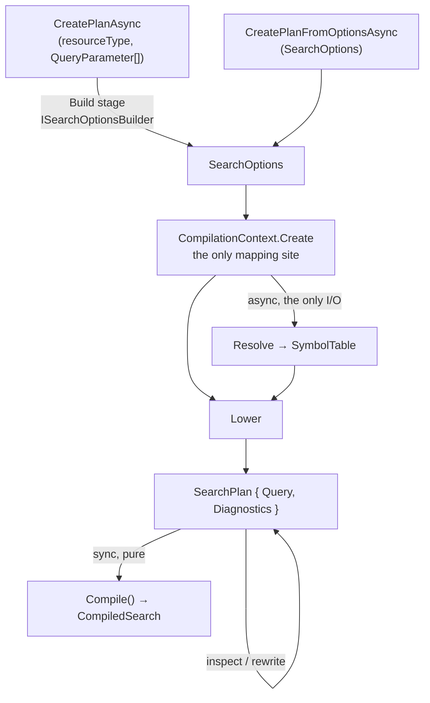

# Ignixa.Search.Sql — public API redesign

**Status:** Design approved, not yet implemented
**Date:** 2026-07-28
**Scope:** The public surface of `Ignixa.Search.Sql` and the internal seam between its stages.

## Problem

`Ignixa.Search.Sql` is a FHIR-search-to-SQL compiler shipping as an alpha package. Its public API is
three static classes in three namespaces, called in a sequence the caller must know by heart:

| Stage | Entry point | Namespace | Parameters |
|-------|-------------|-----------|------------|
| Resolve | `Resolve.RunAsync` | `Ignixa.Search.Sql.Symbols` | 11 |
| Lower | `Lower.Run` | `Ignixa.Search.Sql.Lowering` | 10 |
| Emit | `SqlBuilder.Run` | `Ignixa.Search.Sql.Builders` | 2 |
| Orchestrate | `SearchCompiler.CompileAsync` / `CompileFromOptionsAsync` | `Ignixa.Search.Sql.Tracing` | 8 / 13 |

Four problems follow from that shape.

**The only cohesive entry point is misfiled and mis-typed.** `SearchCompiler` runs the correct stage
sequence, but it lives in `Tracing` and returns `SearchTrace` — a diagnostic record. The one type that
does the job looks like a debugging tool, and a production caller has to reach into a trace for
`CompiledPlan` and `Sql` to get its actual results.

**Resolve and Lower take overlapping inputs kept in step by hand.** Both accept `expression`,
`includes`, `revIncludes`, `sort`, and `targetResourceType`. Nothing prevents them diverging.

**`SearchOptions` and `LowerOptions` are joined by hand-written assignments.** Four properties have
been accepted by the API and silently never forwarded to `Lower` — `AccessConstraints` (an
authorization control that was never enforced), `ResourceTypes` (a multi-`_type` search silently
returned every type), `ResourceVersionTypes` (a caller asking for history got Latest-only results),
and the surrogate-id range. Each shipped, each was found in review, and the current defence is a
15-line XML remarks table asking the next reviewer to check every `LowerOptions` property by hand.

**Naming.** `Resolve` and `Lower` are verb-named static classes that collide with common identifiers.
`SqlBuilder` is a renderer, not a builder.

There is no production consumer today — callers are the test suites, the corpus harness, and one
integration test — so breaking changes are cheap now and expensive later.

## Decisions

| Decision | Choice |
|---|---|
| Audience | One facade serving both internal production wiring and external package consumers |
| Shape | Two-phase: async plan creation, then synchronous compilation |
| Lifetime | Instance service (`ISearchSqlCompiler`) with constructor-injected dependencies |
| Diagnostics | Opt-in; `None` is the default and costs nothing |
| Failures | Hybrid — `CreatePlan*`/`Compile` throw, `TryCreatePlan*`/`TryCompile` return data |
| Stages | `Resolve`, `Lower`, `SqlBuilder` become `internal` |

### Why two phases

`CreatePlanAsync` is async because Resolve is the only stage that touches storage. `Compile()` is
synchronous because Lower and Emit are pure. Today that fact lives in a README paragraph and nowhere
in the signatures; the split encodes it in the type system.

It also gives callers a seam to inspect and rewrite the plan before SQL exists, and it makes failure
attribution largely structural — which call failed *is* the stage.

Two independent signals confirm the seam is real:

- `SearchPlanOptions` bisects along it without argument. Every knob except the diagnostics level is a
  lowering input; only text ranges are emit-time.
- It matches the shape Roslyn uses for the same problem (`Compilation` → `Emit`).

## Architecture



## Public API

All types live in the root `Ignixa.Search.Sql` namespace, so one `using` gets a consumer the whole
front door.

### The service

```csharp
public interface ISearchSqlCompiler
{
    Task<SearchPlan> CreatePlanAsync(
        string? resourceType,
        IReadOnlyList<QueryParameter> parameters,
        SearchPlanOptions? options = null,
        CancellationToken cancellationToken = default);

    Task<SearchPlan> CreatePlanFromOptionsAsync(
        SearchOptions searchOptions,
        string? resourceType,
        SearchPlanOptions? options = null,
        CancellationToken cancellationToken = default);

    Task<SearchPlanResult> TryCreatePlanAsync(
        string? resourceType,
        IReadOnlyList<QueryParameter> parameters,
        SearchPlanOptions? options = null,
        CancellationToken cancellationToken = default);

    Task<SearchPlanResult> TryCreatePlanFromOptionsAsync(
        SearchOptions searchOptions,
        string? resourceType,
        SearchPlanOptions? options = null,
        CancellationToken cancellationToken = default);
}

public sealed class SearchSqlCompiler(
    ISymbolResolver resolver,
    ISearchOptionsBuilder? optionsBuilder = null,
    ICompartmentDefinitionManager? compartmentDefinitionManager = null,
    ISearchParameterDefinitionManager? searchParameterDefinitionManager = null,
    TimeProvider? timeProvider = null) : ISearchSqlCompiler;
```

`optionsBuilder` is required only by the `CreatePlanAsync` (query-string) path; the definition
managers are required only by compartment searches, `$everything`, and `_not-referenced` path
filters. Each throws `InvalidOperationException` naming the missing dependency when a query needs it,
matching the current behaviour of `Resolve`. `timeProvider` defaults to `TimeProvider.System` and is
read exactly once per plan for `:ap` widening.

`resourceType` is nullable on both paths: null or empty means a system-level or wildcard-compartment
search. It is normalized to null exactly once, inside `CompilationContext.Create`, so Resolve, Lower,
and `SystemLevelSearch` all observe the same value.

### The plan

```csharp
public sealed record SearchPlan
{
    /// The lowered plan. Inspect with Query.Explain(); rewrite with `plan with { Query = rewritten }`.
    public required QueryPlan Query { get; init; }

    /// Build/Resolve/Lower diagnostics. Null when DiagnosticsLevel is None.
    public SearchCompilationDiagnostics? Diagnostics { get; init; }

    /// Carried from SearchPlanOptions so Compile() emits at the same detail level.
    public SearchDiagnosticsLevel DiagnosticsLevel { get; init; }

    /// Re-validates the plan before emitting, so a rewritten plan is checked too.
    public CompiledSearch Compile();

    public SearchCompilationResult TryCompile();
}
```

`Query` is `init`, so rewriting is the idiomatic `with` expression and needs no helper method.
Validation happens in `Compile()`, not in the initializer, so constructing a plan never throws.

The property is named `Query` rather than `Plan` to avoid `SearchPlan.Plan`. This is provisional; if a
better name emerges during implementation it can change before the API is public.

`CompiledSearch` exposes the same object as `Plan`, not `Query`, deliberately. `SearchPlan` needs the
rename to avoid `Plan.Plan`; `CompiledSearch` has no such collision, and a property called `Query` on a
type holding SQL text would read as the SQL statement. The asymmetry is the lesser of the two
confusions.

### The result

```csharp
public sealed record CompiledSearch(
    string Sql,
    IReadOnlyList<EmittedSqlParameter> Parameters,
    QueryPlan Plan)
{
    public SearchCompilationDiagnostics? Diagnostics { get; init; }
}

public sealed record SearchPlanResult(SearchPlan? Plan, SearchCompilationFailure? Failure)
{
    [MemberNotNullWhen(true, nameof(Plan))]
    public bool Succeeded => Plan is not null;
}

public sealed record SearchCompilationResult(CompiledSearch? Compiled, SearchCompilationFailure? Failure)
{
    [MemberNotNullWhen(true, nameof(Compiled))]
    public bool Succeeded => Compiled is not null;
}
```

### Options

```csharp
public sealed record SearchPlanOptions
{
    public bool CountOnly { get; init; }
    public int IncludeLimit { get; init; }
    public SortPhase SortPhase { get; init; } = SortPhase.Valued;
    public bool CountPhaseScoped { get; init; }
    public bool IncludesOnly { get; init; }
    public int? Top { get; init; }
    public PageSpec? Page { get; init; }
    public OffsetSpec? OffsetPage { get; init; }
    public (long Start, long End)? SurrogateRange { get; init; }
    public string? SearchParameterHash { get; init; }
    public Expression? OperationExpression { get; init; }
    public SearchDiagnosticsLevel DiagnosticsLevel { get; init; } = SearchDiagnosticsLevel.None;
}
```

`SearchParameterHash` is typed `string?` and wrapped into a `SqlParameterRef` internally, so consumers
never touch an AST type to express a reindex gate.

`OperationExpression` carries a FHIR operation root such as `PatientEverythingExpression`, which no
query string can produce. `CompilationContext.Create` reads it as an override. This replaces the
current behaviour, where `SearchCompiler.CompileAsync` assigns to `options.Expression` and mutates the
caller's own `SearchOptions`.

### Visibility

**Public:** `ISearchSqlCompiler`, `SearchSqlCompiler`, `SearchPlan`, `SearchPlanOptions`,
`SearchPlanResult`, `CompiledSearch`, `SearchCompilationResult`, `SearchCompilationFailure`,
`SearchCompilationException`, `SearchCompilationDiagnostics`, `SearchDiagnosticsLevel`,
`CompilationStage`, `QueryPlan` (and the AST records reachable from it, so rewriting is possible),
`EmittedSqlParameter`, `ISymbolResolver`, `SqlCatalog`, `AccessConstraint`, `OffsetSpec`, `SortPhase`,
`ResourceVisibility`, `PageSpec`, `SqlParameterRef`.

**Internal:** `Resolve`, `Lower`, `SqlBuilder`, `EmitOptions`, `LoweredPlan`, `ResolvedSymbols`,
`SymbolTable`, `EmittedSql`.

**Deleted:** `LowerOptions`, `Tracing.SearchCompiler`, `Tracing.SearchTrace`, `Tracing.TraceFailure`,
`Tracing.EmittedSqlTrace`.

**Moved to the root namespace:** the `Tracing` types that stay public — `QueryPlanTrace`,
`CteProvenance`, `ImplicitParameter` — move to `Ignixa.Search.Sql` alongside the rest of the facade, and
the `Tracing` namespace disappears. `SqlTextRange` stays in `Builders` but is re-exported through
`SearchCompilationDiagnostics`. `ParameterTrace` is not ours: it belongs to `Ignixa.Search.Parsing`,
where the options builder produces it, and stays there.

## Internal pipeline

`LowerOptions` is deleted. One internal `CompilationContext` is built once and consumed by both
stages, so they cannot observe different inputs.

```csharp
internal sealed record CompilationContext
{
    // Shared by Resolve and Lower — the inputs that must never diverge.
    public required Expression? Expression { get; init; }
    public required string? TargetResourceType { get; init; }
    public required IReadOnlyList<IncludeExpression> Includes { get; init; }
    public required IReadOnlyList<IncludeExpression> RevIncludes { get; init; }
    public required IReadOnlyList<SortExpression> Sort { get; init; }
    public required IReadOnlyList<AccessConstraint> AccessConstraints { get; init; }
    public required IReadOnlyList<string> ResourceTypes { get; init; }

    // Lower-only, derived here so there is exactly one construction site.
    public required DateTimeOffset ApproximationReferenceTime { get; init; }
    public required ResourceVisibility? Visibility { get; init; }
    public required SurrogateIdRange? SurrogateRange { get; init; }
    public required SearchPlanOptions Options { get; init; }

    public bool SystemLevelSearch => TargetResourceType is null;
}
```

Stage signatures collapse:

```csharp
internal static Task<ResolvedSymbols> Resolve.RunAsync(CompilationContext ctx, SymbolResolution deps, CancellationToken cancellationToken);
internal static LoweredPlan               Lower.Run(CompilationContext ctx, SymbolTable symbols);
internal static EmittedSql                SqlBuilder.Run(QueryPlan plan, EmitOptions? options);
```

`SymbolResolution` groups the resolver and the two optional definition managers, which the compiler
holds from construction.

Existing mapping rules preserved in `CompilationContext.Create`:

- `ResourceVersionTypes.None` throws `NotSupportedException` — not a valid search input.
- `ResourceVersionTypes.Latest` alone maps to a null `Visibility`, which `QueryPlan.EffectiveVisibility`
  already treats as `ResourceVisibility.Current`.
- A half-open surrogate range (one of `StartSurrogateId`/`EndSurrogateId` set) throws
  `NotSupportedException` rather than scanning unbounded in one direction.
- An explicit `SearchPlanOptions.SurrogateRange` wins over the `SearchOptions` pair.
- `OffsetPage` cannot combine with keyset `Page` or `Top` (T-SQL error 10741).
- `CountPhaseScoped` requires `CountOnly` and at least one sort key.

`Page` is the keyset continuation boundary that `Lower.Run` accepts as a separate argument today.
`SearchCompiler` always passed null for it, so the compiler supported keyset paging but no orchestrated
entry point could ask for it. Putting it on `SearchPlanOptions` closes that gap rather than carrying it
forward.

## Diagnostics

```csharp
public enum SearchDiagnosticsLevel
{
    None = 0,   // default — nothing captured, no allocation
    Parameters, // per-parameter outcomes, implicit parameters, failure attribution
    Full,       // + plan explain rows, + SQL text ranges
}

public sealed record SearchCompilationDiagnostics
{
    public IReadOnlyList<ParameterTrace> Parameters { get; init; } = [];
    public IReadOnlyList<ImplicitParameter> Implicit { get; init; } = [];
    public QueryPlanTrace? Plan { get; init; }
    public IReadOnlyList<SqlTextRange> SqlTextRanges { get; init; } = [];
}
```

`SearchTrace` is deleted and its contents redistributed:

| `SearchTrace` member | Lands on |
|---|---|
| `ResourceType` | dropped — the caller passed it |
| `Parameters`, `Implicit` | `SearchCompilationDiagnostics` |
| `Plan` (`QueryPlanTrace`) | `SearchCompilationDiagnostics.Plan` |
| `Sql` (`EmittedSqlTrace`) | split — `CompiledSearch.Sql`/`.Parameters` are first-class, text ranges go to `Diagnostics.SqlTextRanges` |
| `Failure` | `SearchCompilationFailure` |
| `CompiledPlan` | `SearchPlan.Query` — first-class, not a diagnostic |

That last row is the point of the redesign: a production caller needing the plan's shape to pick a
result-row reader reads a primary return value, not a debugging artifact.

`ParameterTrace` and `ImplicitParameter` keep their current definitions. See Visibility above for where
each type ends up.

**Cost model.** `None` passes no outcome list to the builder, leaves `EmitOptions.IncludeTextRanges`
false, and never runs `PlanExplainer`. `Parameters` costs one list the builder fills anyway. `Full`
is the tooling path.

**Attachment.** Plan-phase diagnostics ride on `SearchPlan.Diagnostics`. `Compile()` merges them with
emit-phase ranges onto `CompiledSearch.Diagnostics`. On failure paths the same object hangs off
`SearchCompilationFailure.Diagnostics`, so a failed compile still explains itself.

**Known limitation.** `CreatePlanFromOptionsAsync` never runs Build, so it has no `ParameterTrace`
outcomes and cannot distinguish an explicit `_count` from a server default. At `Parameters` and `Full`
it yields plan and SQL diagnostics with empty `Parameters` and `Implicit`. This matches today's
behaviour; the difference is that it is stated in the type's documentation rather than discovered.

## Error handling

```csharp
public enum CompilationStage { Build, Resolve, Lower, Emit }

public sealed record SearchCompilationFailure(
    CompilationStage Stage,
    string Message,
    string? ParameterCode,
    SourceSpan? Span,
    Exception? Exception)
{
    public SearchCompilationDiagnostics? Diagnostics { get; init; }
}

public sealed class SearchCompilationException(SearchCompilationFailure failure) : Exception
{
    public SearchCompilationFailure Failure { get; } = failure;
}
```

| Condition | `CreatePlan*Async` / `Compile()` | `TryCreatePlan*Async` / `TryCompile()` |
|---|---|---|
| Unresolved search parameter | `SearchCompilationException(Resolve)` | `Failure { Stage = Resolve }` |
| Unsupported query shape (today's `NotSupportedException` from Lower) | `SearchCompilationException(Lower)` | `Failure { Stage = Lower }` |
| Missing symbol during lowering (today's `KeyNotFoundException`) | `SearchCompilationException(Lower)` | `Failure { Stage = Lower }` |
| Incoherent plan shape (`RejectUnsupportedCombinations`) | `SearchCompilationException(Emit)` | `Failure { Stage = Emit }` |
| Query-string binding or value parse (`FhirException`) | propagates unwrapped | `Failure { Stage = Build, Exception = the FhirException }` |
| `ArgumentException`, `ArgumentNullException`, any other type | propagates | propagates |
| `OperationCanceledException` | propagates | propagates |

Three deliberate choices:

**`FhirException` is not wrapped on the throwing path.** It is the repo's user-facing error type; the
API layer turns it into an `OperationOutcome`. Wrapping would force every caller to unwrap. The `Try`
path still captures it as data, so the "never throws for query-shape problems" promise holds where it
is made.

**Programmer errors are never swallowed.** The trace records' construction guards (`SqlTextRange`,
`CteProvenance`, `PlanExplainRow`) throw `ArgumentException` and none can trip on a well-formed plan —
they detect defects in this compiler. Catching them would file a compiler bug as though it were a
property of the user's query. A `NullReferenceException` must still fail loudly.

**Unresolved parameters become a failure, not a silent empty plan.** Today `Resolve` reports them as
data and `SearchCompiler` skips `Lower`, returning a trace with a null plan. Under the new contract
that is `Stage.Resolve` on both paths, and no null-plan state exists.

**Attribution is free.** `ParameterCode` and `Span` are read from `ex.Data`, populated by
`LeafLoweringDispatcher` during lowering. They are present at `SearchDiagnosticsLevel.None`. Only the
richer per-parameter outcomes require diagnostics to be enabled.

### Out of scope

A whole-plan `IsUnsatisfiable` short-circuit. `MarkKnownMisses` detects a `Predicate.False` per CTE,
and promoting that to "skip the database round trip" is tempting, but a false predicate in one CTE
does not make the plan unsatisfiable — an `Or` branch elsewhere can still match. A correct verdict
needs analysis over the CTE graph. Recorded as a follow-up.

## Testing

### Completeness test

The four shipped defects share one shape: a `SearchOptions` property accepted by the API that never
became a compilation input. `CompilationContext.Create` is now the only place that mapping happens, so
it can be enforced by a test instead of a doc comment:

```csharp
[Fact]
public void GivenEverySearchOptionsProperty_WhenCreatingCompilationContext_ThenEachIsMappedOrExplicitlyExcluded()
{
    var classified = CompilationContextMapping.Mapped
        .Concat(CompilationContextMapping.NotApplicable.Keys);

    typeof(SearchOptions).GetProperties()
        .Select(p => p.Name)
        .Except(classified)
        .ShouldBeEmpty("every SearchOptions property must be mapped into CompilationContext or listed " +
                       "in NotApplicable with a stated reason");
}
```

`NotApplicable` is a dictionary of property name to reason, seeded from the reasons already written in
the current XML documentation — for example `MaxItemCount` (callers transform it before a search runs;
`SearchResourcesHandler` requests `MaxItemCount + 1` to detect "has more") and `ContinuationToken`
(decoded by the adapter layer). Adding a property to `SearchOptions` fails the build until someone
classifies it.

### Behaviour preservation

Golden SQL and corpus tests are the regression net. This refactor must emit byte-identical SQL for
every existing case. A moved golden file means the refactor changed behaviour and is wrong.

### Migration

Roughly 27 files, but the call-site count is what determines the approach:

| Stage | Call sites in `test/` | Signature changes? | Work |
|---|---|---|---|
| `SqlBuilder.Run` | 191 | no — visibility only | **none**; `InternalsVisibleTo` already covers it |
| `Lower.Run` | 91 | yes | mechanical rename to a test harness |
| `Resolve.RunAsync` | 23 | yes | mechanical rename to a test harness |
| `SearchCompiler.*` | 35 | replaced | rewritten against the facade |

91 hand-edited `Lower.Run` call sites would be a large diff over the exact tests that prove this
refactor changed nothing — precisely the diff a reviewer cannot check. So the stage tests do **not**
migrate to the new argument shape. Instead:

- `LowerOptions` **moves into the test project** as test support rather than being deleted outright. It
  survives only as the harness's input record; no production code references it.
- `LowerHarness.Run(...)` and `ResolveHarness.RunAsync(...)` in `Ignixa.Search.Sql.Tests/TestSupport/`
  reproduce today's argument lists exactly, build a `CompilationContext`, and call the collapsed stage.
- Migration is then a single find/replace per stage: `Lower.Run(` → `LowerHarness.Run(`. Every argument,
  including named arguments and `new LowerOptions { … }` initialisers, is unchanged. The diff is one
  token per line, so a reviewer can confirm by inspection that no test's meaning moved.

New tests written after this refactor should use `CompilationContextFactory.For(expression, resourceType)`
and call the stages directly; the harnesses exist to carry the existing corpus across, not to be the
permanent idiom.

| Project | Change |
|---|---|
| `Ignixa.Search.Sql.Tests` — `Lowering/*`, `Ast/Emit*`, `Symbols/*` (~20 files) | find/replace onto the harnesses; no test body changes |
| `Ignixa.Search.Sql.Tests/Tracing/*` | rewritten against the facade; `SearchTraceFixtures` becomes plan and diagnostics fixtures |
| `Ignixa.Search.Sql.Tests/Corpus/CorpusCompiler` | facade; drops its manual stage wiring |
| `Ignixa.Application.Tests/Search/Parsing/SearchTrace*Tests` | facade, **public API only** — proof the facade is sufficient without internals |
| `Ignixa.DataLayer.SqlEntityFramework.IntegrationTests/CompiledSearchEndToEndTests` | facade; today it hand-chains all three stages and is the closest thing to a production consumer |

### Dependency injection

`Ignixa.Search.Sql` has no ASP.NET or Autofac reference and keeps none. The layer that supplies
`ISymbolResolver` registers `ISearchSqlCompiler` alongside it.

## Documentation

`src/Core/Ignixa.Search.Sql/README.md` needs three changes:

1. The alpha warning names `Resolve / Lower / SqlBuilder` as the public API. That line is now wrong.
2. Quick start becomes the two-phase facade.
3. The three-stage diagram stays, reframed as *how it works inside* rather than *what you call*.

## Consequences

**Better.** One entry point, discoverable from the root namespace. The I/O boundary is visible in the
signatures. A plan can be inspected and rewritten before SQL exists. The `SearchOptions` forwarding
defect class is caught by a failing build rather than by a reviewer. Diagnostics cost nothing when
unused. Production callers stop reading their results out of a debugging type.

**Worse.** Every stage-level test changes shape. The public surface grows by roughly ten types,
though each is small and single-purpose. Plan rewriting is a new hazard: `@pN` numbering, CTE naming
and ordering, and the keyset-seek predicate staying in lockstep with `ORDER BY` are invariants Lower
establishes, and a rewritten plan can violate them. `Compile()` re-runs
`RejectUnsupportedCombinations`, but that does not catch everything — the README must state what
survives a rewrite.

**Reversible.** The package is alpha with no production consumer, so the cost of being wrong is a
follow-up alpha release.
